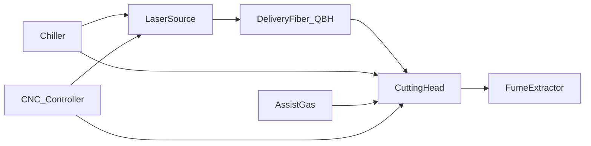

---
aliases:
  - fiber laser reference
  - fiber laser cutter overview
type: technical-reference
category: fiber-lasers
applies_to: [fiber-laser]
source_reviewed: 2026-08-05
source_scope: Synthesized from GWK/Arcus install guides, OEM chiller and gas documentation, field-service references
status: generic reference — verify against nameplate and project drawing
---

# Fiber Laser Cutters

> [!info] When to open this note
> Start here for subsystem orientation, links to auxiliary equipment, and power-class context. Use before commissioning an unfamiliar fiber laser, when training someone on the technology, or when tracing a fault that could sit in more than one subsystem.

> [!warning] Verify locally
> Source model, head type, chiller loops, gas package, and controller vary by machine and by manufacturing batch even within the same model line. Record nameplate data on the machine hub note before relying on any generic range in this library.

Return to [[Technical Reference Index]].

## How a fiber laser actually cuts

A fiber laser cutter does not burn or melt material with a broad heat source — it focuses a very small, very intense spot of near-infrared light (around 1030–1090 nm, commonly quoted as ~1064 or ~1070 nm) onto the sheet. At that power density the material locally melts or vaporizes in microseconds. An assist gas jet, coaxial with the beam and delivered through the nozzle, then blows the molten or vaporized material out of the kerf ahead of and below the beam. The X/Y motion system moves the head (or in some architectures moves the gantry/table) to trace the cutting path while the Z-axis height controller keeps the nozzle at a constant standoff from the sheet surface so the focus point stays consistent.

This means a "successful cut" is the product of several systems working together at once: enough optical power reaching the kerf, the right assist gas at the right pressure and purity, an accurately maintained focus position, and a stable standoff height. A fault or degradation in any single subsystem — a dirty window, low gas pressure, poor grounding disturbing the height sensor, a chiller running warm — shows up as a cut-quality problem even though the "laser" itself may be perfectly healthy.

## What a fiber laser cutting system includes

A production fiber laser cutter is not one box — it is a coordinated set of subsystems, several of which are supplied by different vendors and integrated by the machine builder:

| Subsystem | Function | Reference notes |
| --- | --- | --- |
| Laser source (resonator/module) | Generates the ~1064 nm beam and launches it into the delivery fiber | [[Fiber Laser Power Classes]], [[Laser Water Chillers]] |
| Delivery fiber + QBH | Transports the beam from source to head with minimal loss | [[QBH Fiber Delivery Cable]], [[Fiber Cable Bend Radius and Routing]] |
| Cutting head | Collimates and focuses the beam, delivers assist gas coaxially, carries the height sensor | [[Cutting Head Nozzles and Ceramics]], [[Capacitive Height Sensing BCS100]] |
| Assist gas system | Supplies O₂, N₂, or dry compressed air to the kerf at the correct pressure | [[Assist Gas Overview]] |
| Chiller | Removes waste heat from the source and (usually separately) the head/optics | [[Dual-Temperature Chiller Circuits]], [[Cooling Water Quality]] |
| Fume extraction | Captures metal smoke, oxide particulate, and fine dust at the cutting zone | [[Laser Fume Extraction Overview]] |
| CNC + height controller | Coordinates motion, process "layers" (speed/power/gas per segment), and Z-axis follow | [[Autofocus and Proportional Gas Valves]] |
| Shop air / N₂ plant | Feeds air-cutting assist or an on-site nitrogen generator | [[Air Compressors for Laser Cutting]], [[PSA Nitrogen Generators]] |
| Motion system | X/Y (and sometimes rotary/tube) axes — servo motors, linear guides, racks or ballscrews, encoders | Machine-specific manual |
| Bed and slats | Supports the sheet, forms the electrical ground reference for height sensing, channels smoke into extraction ducts | [[Grounding and EMC Isolation]] |
| Safety system | E-stops, door interlocks, beam shutters, key switches | [[Nozzle Change and Shutter Actuators]] |

Notice the two arrows into the chiller box and the two out of the CNC box — this is the most common place installers under-appreciate the system: **the source and the head are usually on separate thermal and electrical circuits even though they share one chiller cabinet and one controller.** A fault that looks like "the laser" is often specifically the head circuit or specifically the source circuit, and diagnosis is much faster once you know which.

## Typical machine sizes

| Format | Bed example | Common power | Notes |
| --- | --- | --- | --- |
| Small sheet | 1500 × 3000 mm (3015) | 1–6 kW | Common job-shop format; see [[Gweike 3015GAII]] |
| Medium sheet | 2000 × 4000 mm (4020) | 3–12 kW | Higher gas and extraction demand; see [[Gweike 4020GA]] |
| Large sheet | 2000 × 6000 mm (2060) | 6–20 kW | Long duct runs, larger chiller; see [[JQ-2060E]] |
| Compact | 1500 × 4000 mm (2040) | 1–3 kW | See [[JQ-2040E]] |
| Tube/pipe cutting | Varies — rotary chuck axis added | 1–6 kW typical | Adds a rotary axis and different fixturing; not covered separately in this library yet |

Table size affects extraction airflow calculation and floor loading — not laser physics alone. Two machines with identical laser source power but different bed sizes need materially different compressor, chiller hose run, and extraction plant. See [[Fiber Laser Site Requirements]] and [[Dust Collector Sizing]].

## Power class quick comparison

Detailed ranges: [[Fiber Laser Power Classes]].

| Class | Typical electrical draw (wall) | N₂ flow hint (cutting) | Chiller class hint |
| --- | --- | --- | --- |
| 1–3 kW | 15–25 kW total cell | ~1.5 m³/min | CW-5200 / CW-6000 single loop or dual |
| 4–6 kW | 25–40 kW | ~2–3 m³/min | CW-6100 / 6200 dual-temp |
| 8–12 kW+ | 40–80 kW+ | 3 m³/min+ | OEM industrial chiller, dual loop mandatory |

## Why fiber replaced CO₂ for metal cutting

For technicians moving between technologies, it helps to know *why* fiber dominates the metal-cutting market today:

| Factor | Fiber | CO₂ |
| --- | --- | --- |
| Wall-plug efficiency | ~35–45% | ~8–12% |
| Beam absorption by metals | Higher (shorter wavelength) | Lower — needs more power for same result on reflective metals |
| Moving parts in beam path | None (solid-state, fiber delivered) | Bend mirrors, resonator optics |
| Maintenance | Lower — sealed diode modules, no gas refill, no mirror alignment | Mirror cleaning/alignment, resonator gas |
| Best fit | Sheet and plate metal | Organics, acrylic, wood, mixed material shops |

This is why the Indepth Technology fleet ([[Gweike 3015GAII]], [[Gweike 4020GA]], [[JQ-2040E]], [[JQ-2060E]]) is entirely fiber. See [[CO2 Laser Cutters]] and [[CO2 vs Fiber Auxiliary Differences]] if you ever service a CO₂ machine for a customer.

## Installation sequence (summary)

Full detail: [[Fiber Laser Commissioning Sequence]].

1. Site prep — power, ground, foundation, clearances ([[Installation Clearances and Foundations]], [[Laser Electrical Supply Requirements]])
2. Unload and level bed/frame
3. Chiller fill and pipe ([[Cooling Water Quality]])
4. Fiber route and QBH mate ([[Fiber Cable Bend Radius and Routing]])
5. Head mount and cable dress
6. Gas and shop air connect ([[Assist Gas Overview]])
7. Extraction duct ([[Ductwork and Static Pressure]])
8. Control power-on, homing, chiller run
9. Red light / beam alignment, height cal ([[Capacitive Height Sensing BCS100]])
10. Coupon trials — [[Cutting Parameters Index]]

## Common alarm categories

See [[Fiber Laser Common Alarms]] for symptom tables. Broad groups:

- **Chiller** — E1–E6, flow, dew point ([[CW Series Chiller Alarm Codes]])
- **Height sensor** — capacitance, follow error ([[Height Sensor Alarm Reference]])
- **Gas** — low pressure, purity-related cut quality (not always a hard alarm)
- **Source** — over-temperature, interlock, back-reflection
- **Extraction** — differential pressure, filter saturation
- **Motion** — servo fault, encoder error, soft-limit trip (machine-specific, not covered generically here)

## Diagnostic mental model for a new fault

When you don't yet know which subsystem is at fault, work through this order — it tends to find the answer fastest because it goes from "cheap and fast to check" to "expensive and slow to check":

1. **Read the exact alarm text** — do not paraphrase; different alarms with similar wording point to different subsystems.
2. **Check the obviously physical things first** — water level, gas bottle pressure, nozzle condition, extraction running. These cause a disproportionate share of "mystery" faults.
3. **Check the environment** — room temperature and humidity, especially in summer ([[Dew Point and Chiller Setpoints]]).
4. **Check grounding** if the fault is intermittent or unstable rather than a hard failure ([[Grounding and EMC Isolation]]).
5. **Only then** suspect the source, head optics, or controller hardware itself.

## CO2 comparison

Fiber and CO₂ share auxiliaries at a high level (gas, chiller, extraction) but requirements differ in specifics — resonator cooling temperature, gas mix, and extraction filtration all diverge. See [[CO2 vs Fiber Auxiliary Differences]] and [[CO2 Laser Cutters]].

## Field mistakes that look like "laser faults"

| What the customer reports | Often actually |
| --- | --- |
| "Laser power is down" | Dirty window, low gas pressure, wrong focus, warm chiller |
| "Height sensor is broken" | Slag on nozzle, cracked ceramic, bad ground |
| "Needs a new source" | Condensation damage, fiber bend damage, interlock open |
| "Extraction is fine, still smoky" | Loaded filters, wrong damper zone, enclosure open |
| "N₂ is bad" | Dynamic pressure collapse, not purity certificate |

Always walk subsystems before condemning the source module.

## Measurement kit worth carrying

| Tool | Use |
| --- | --- |
| Multimeter | Interlock Ω, 24 V coils, PE continuity |
| Dynamic pressure gauge / test port adapter | Assist gas under flow |
| Hygrometer with dew point | Summer HT setpoint |
| Infrared thermometer | QBH / chiller condenser inlet |
| Lint-free wipes + IPA | Window/QBH inspect |
| Spare nozzles + ceramic | Height alarms on first visit |

## Related notes

- [[Fiber Laser Power Classes]]
- [[Fiber Laser Site Requirements]]
- [[Fiber Laser Commissioning Sequence]]
- [[Fiber Laser Common Alarms]]
- [[Technical Reference Index]]

## Local machines

- [[Gweike 3015GAII]] — 3 kW stated, CypCut, Raycus source
- [[Gweike 4020GA]]
- [[JQ-2040E]]
- [[JQ-2060E]]

## Sources

- GWK fiber laser installation requirements checklist
- Arcus CNC laser installation and environmental setup guides
- Field-service capacitive sensing and chiller OEM documentation
