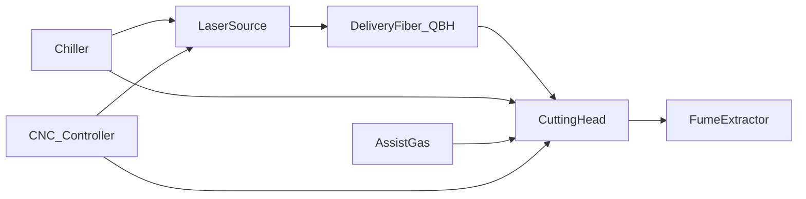

---
aliases:
  - fiber laser reference
  - fiber laser cutter overview
type: technical-reference
category: fiber-lasers
applies_to: [fiber-laser]
source_reviewed: 2026-08-05
source_scope: Synthesized from GWK/Arcus install guides, OEM chiller and gas documentation, field-service references
status: generic reference — verify against nameplate and project drawing
---

# Fiber Laser Cutters

> [!info] When to open this note
> Start here for subsystem orientation, links to auxiliary equipment, and power-class context. Use before commissioning an unfamiliar fiber laser or when tracing a fault across multiple subsystems.

> [!warning] Verify locally
> Source model, head type, chiller loops, gas package, and controller vary by machine. Record nameplate data on the machine hub note before relying on generic ranges.

Return to [[Technical Reference Index]].

## What a fiber laser cutting system includes

A production fiber laser cutter is not one box — it is a coordinated set of subsystems:

| Subsystem | Function | Reference notes |
| --- | --- | --- |
| Laser source (resonator) | Generates 1064 nm beam in fiber | [[Fiber Laser Power Classes]], [[Laser Water Chillers]] |
| Delivery fiber + QBH | Transports beam source → head | [[QBH Fiber Delivery Cable]], [[Fiber Cable Bend Radius and Routing]] |
| Cutting head | Focuses beam, delivers assist gas, height follow | [[Cutting Head Nozzles and Ceramics]], [[Capacitive Height Sensing BCS100]] |
| Assist gas | O₂, N₂, or dry air for kerf process | [[Assist Gas Overview]] |
| Chiller | Removes heat from source, head, sometimes cable | [[Dual-Temperature Chiller Circuits]], [[Cooling Water Quality]] |
| Fume extraction | Captures metal smoke and particulate | [[Laser Fume Extraction Overview]] |
| CNC + height controller | Motion, process layers, capacitive follow | [[Autofocus and Proportional Gas Valves]] |
| Shop air / N₂ plant | Feed for air cutting or PSA nitrogen | [[Air Compressors for Laser Cutting]], [[PSA Nitrogen Generators]] |

## Typical machine sizes

| Format | Bed example | Common power | Notes |
| --- | --- | --- | --- |
| Small sheet | 1500 × 3000 mm (3015) | 1–6 kW | Common job-shop format; see [[Gweike 3015GAII]] |
| Medium sheet | 2000 × 4000 mm (4020) | 3–12 kW | Higher gas and extraction demand; see [[Gweike 4020GA]] |
| Large sheet | 2000 × 6000 mm (2060) | 6–20 kW | Long duct runs, larger chiller; see [[JQ-2060E]] |
| Compact | 1500 × 4000 mm (2040) | 1–3 kW | See [[JQ-2040E]] |

Table size affects extraction airflow calculation and floor loading — not laser physics alone. See [[Fiber Laser Site Requirements]] and [[Dust Collector Sizing]].

## Power class quick comparison

Detailed ranges: [[Fiber Laser Power Classes]].

| Class | Typical electrical draw (wall) | N₂ flow hint (cutting) | Chiller class hint |
| --- | --- | --- | --- |
| 1–3 kW | 15–25 kW total cell | ~1.5 m³/min | CW-5200 / CW-6000 single loop or dual |
| 4–6 kW | 25–40 kW | ~2–3 m³/min | CW-6100 / 6200 dual-temp |
| 8–12 kW+ | 40–80 kW+ | 3 m³/min+ | OEM industrial chiller, dual loop mandatory |

## Installation sequence (summary)

Full detail: [[Fiber Laser Commissioning Sequence]].

1. Site prep — power, ground, foundation, clearances ([[Installation Clearances and Foundations]], [[Laser Electrical Supply Requirements]])
2. Unload and level bed/frame
3. Chiller fill and pipe ([[Cooling Water Quality]])
4. Fiber route and QBH mate ([[Fiber Cable Bend Radius and Routing]])
5. Head mount and cable dress
6. Gas and shop air connect ([[Assist Gas Overview]])
7. Extraction duct ([[Ductwork and Static Pressure]])
8. Control power-on, homing, chiller run
9. Red light / beam alignment, height cal ([[Capacitive Height Sensing BCS100]])
10. Coupon trials — [[Cutting Parameters Index]]

## Common alarm categories

See [[Fiber Laser Common Alarms]] for symptom tables. Broad groups:

- **Chiller** — E1–E6, flow, dew point ([[CW Series Chiller Alarm Codes]])
- **Height sensor** — capacitance, follow error ([[Height Sensor Alarm Reference]])
- **Gas** — low pressure, purity-related cut quality (not always a hard alarm)
- **Source** — over-temperature, interlock, back-reflection
- **Extraction** — differential pressure, filter saturation

## CO2 comparison

Fiber and CO₂ share auxiliaries at a high level (gas, chiller, extraction) but requirements differ. See [[CO2 vs Fiber Auxiliary Differences]] and [[CO2 Laser Cutters]].

## Related notes

- [[Fiber Laser Power Classes]]
- [[Fiber Laser Site Requirements]]
- [[Fiber Laser Commissioning Sequence]]
- [[Fiber Laser Common Alarms]]
- [[Technical Reference Index]]

## Local machines

- [[Gweike 3015GAII]] — 3 kW stated, CypCut, Raycus source
- [[Gweike 4020GA]]
- [[JQ-2040E]]
- [[JQ-2060E]]

## Sources

- GWK fiber laser installation requirements checklist
- Arcus CNC laser installation and environmental setup guides
- Field-service capacitive sensing and chiller OEM documentation
