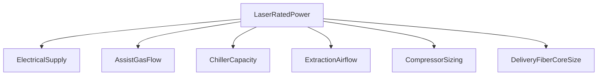

---
aliases:
  - laser kW comparison
  - fiber laser power sizing
type: technical-reference
category: fiber-lasers
applies_to: [fiber-laser]
source_reviewed: 2026-08-05
source_scope: GWK install checklist, Arcus environmental guide, industry sizing tables
status: generic reference — verify against nameplate and project drawing
---

# Fiber Laser Power Classes

Return to [[Fiber Laser Cutters]] · [[Technical Reference Index]]

> [!info] When to open this note
> Comparing electrical supply, gas flow, chiller capacity, extraction, and compressor sizing across 1–3 kW, 4–6 kW, and 8–12 kW+ machines — for quoting, planning a new install, or sanity-checking whether an existing auxiliary is grossly undersized for the laser bolted to it.

> [!warning] Nameplate wins
> Rated laser power ≠ wall draw, and wall draw ≠ auxiliary sizing. Always size auxiliaries from the manufacturer's bill of quantities and measured load on the actual installed machine, not from this table alone.

## Class overview

| Class | Typical rated power | Primary use | Typical bed formats |
| --- | --- | --- | --- |
| Entry / job shop | 1–3 kW | Thin mild steel, stainless to ~6 mm, air or N₂ | 1500×3000 (3015), compact 2040 |
| Mid production | 4–6 kW | 6–16 mm carbon steel, stainless, aluminum | 3015, 4020 |
| Heavy / high speed | 8–12 kW+ | Thick plate, high feed rates, large tables | 4020, 2060, larger |
| Ultra-high power | 15–30 kW+ | Very thick plate, maximum throughput shops | Large-format only; specialist install |

As rated power rises, cut speed on a given thickness rises roughly in proportion up to a point of diminishing returns (kerf quality and gas delivery become the limiting factor before raw power does). This matters for technicians because a customer asking "why isn't my 6 kW machine twice as fast as my old 3 kW" needs to hear about gas delivery and motion dynamics, not just optical power.

## Why power class drives every auxiliary decision

A laser source rated at a given kW is only one line item in the total heat and utility load of the cell. Every auxiliary system in this library scales — non-linearly in some cases — with the source rating:

Undersizing any one of these against the installed laser class is one of the most common causes of "the machine can't reach its rated performance" complaints on a newly commissioned cell.

## Electrical supply (typical total cell)

Includes laser, servos, chiller, extraction fan, controls — not compressor unless on same feeder.

| Laser class | Laser source wall draw (approx.) | Total cell hint (approx.) | Supply notes |
| --- | --- | --- | --- |
| 1–3 kW | 9–15 kW | 20–30 kW | 380 V 3-phase common; dedicated circuit |
| 4–6 kW | 15–25 kW | 30–45 kW | Phase imbalance <2.5%; regulator recommended |
| 8–12 kW | 25–45 kW | 45–70 kW+ | Often separate transformer; verify with OEM |
| 15–30 kW+ | 45–90 kW+ | 70–120 kW+ | Site electrical study usually required; may need substation upgrade |

See [[Laser Electrical Supply Requirements]] for wiring, grounding, and power-quality targets.

## Assist gas flow (nitrogen cutting, indicative)

GWK-style reference values for planning — measure on site under cut load, since actual consumption depends heavily on nozzle diameter, pierce strategy, and material thickness mix.

| Laser power | N₂ flow reference (m³/min) | Output pressure reference | Notes |
| --- | --- | --- | --- |
| ≤3 kW | ~1.5 | up to ~2.0 MPa | Dewar supply usually adequate |
| >3 kW to 6 kW | ~2.2 | up to ~2.0 MPa | Consider bulk tank if high duty cycle |
| 8 kW+ | 3+ | OEM spec; booster often required | PSA + booster common at this tier |
| 15 kW+ | 4–6+ | OEM spec | Central plant with multiple boosters typical |

Purity: N₂ ≥99.99% for stainless and bright edges — [[Nitrogen Assist Gas]]. Higher power classes are less forgiving of purity shortfalls because higher cutting speed means less dwell time for the gas to do its job, so any contamination shows up faster as edge discoloration.

## Chiller sizing hint

| Laser class | Typical chiller | Loops | Approx. refrigeration duty |
| --- | --- | --- | --- |
| 1–3 kW | CW-5200/6000 class | Single or dual | 1.5–2 kW |
| 4–6 kW | CW-6100/6200 class | Dual-temp preferred | 3–5 kW |
| 8–12 kW+ | OEM matched unit | Dual mandatory | 8 kW+ |
| 15–30 kW+ | Industrial packaged chiller, often site-built | Dual, sometimes triple (source/head/electronics) | 15 kW+ |

Dual-loop concept: [[Dual-Temperature Chiller Circuits]]. Above about 6 kW, running a single-loop chiller (one temperature for everything) becomes a real risk — the source wants a cooler, tighter-tolerance loop than the head can tolerate before condensation becomes likely in humid conditions.

## Air cutting (compressed air assist)

Requires oil-free dry air to ~1.6–3.0 MPa depending on head and material. Higher power generally means higher sustained flow, both because nozzle orifices tend to be larger and because higher-speed cutting consumes gas faster per unit time even at the same instantaneous flow rate.

| Laser class | Compressor hint |
| --- | --- |
| 1–3 kW | 11–15 kW screw + dryer + filtration |
| 4–6 kW | 15–22 kW screw, 16 bar class common |
| 8 kW+ | Sized from OEM CFM at cut pressure; often 22 kW+ |
| 15 kW+ | Often abandons air cutting in favor of N₂/O₂ for most work; air reserved for scrap/thin jobs |

See [[Compressor Sizing by Laser Power]] and [[Compressed Air Cutting]].

## Fume extraction hint

| Laser class | Air volume hint (m³/h) | Notes |
| --- | --- | --- |
| 1–3 kW on 3015 table | 6000–8000 | Increase for stainless/aluminum fine dust |
| 4–6 kW on 4020 | 8000–12000 | High speed ↑ loading |
| 8 kW+ large bed | 12000–20000+ | Central plant common |
| 15 kW+ | 20000+ | Usually multiple zones with dampers, central plant mandatory |

Formula: [[Dust Collector Sizing]]. Note that extraction load tracks **material removal rate**, not laser power directly — a high-power machine running slow, thick-plate O₂ cuts can generate less fume mass per minute than a mid-power machine running fast, thin N₂ cuts at high duty cycle. Use the actual production mix when sizing, not just the nameplate kW.

## Cutting head and optics

Higher power generally means:

- Larger core delivery fiber (a step from ~50 µm toward ~100 µm core diameter is common as rated power climbs past roughly 6 kW, though exact figures are source-model specific)
- Water-cooled QBH mandatory above roughly 2 kW continuous — air-cooled QBH variants exist only at the low end
- Head rated for power and duty; protective window spec, coating, and replacement frequency all change with power
- Larger nozzle orifices for a given material thickness band, which in turn raises gas consumption

See [[QBH Fiber Delivery Cable]].

## Worked example — sanity-checking a customer's setup

A customer reports their 6 kW fiber laser "can't cut like the brochure said." Before assuming the laser source is faulty, check against this table:

1. **Electrical** — is the cell actually receiving 30–45 kW class supply, or was it wired for a smaller machine previously on the same slab?
2. **Gas** — is N₂ flow capable of ~2.2 m³/min at 2.0 MPa under load, or is the dewar/regulator sized for a 3 kW machine that used to be there?
3. **Chiller** — is it a dual-loop 3–5 kW class unit, or a single-loop 1.5 kW unit inherited from an earlier, smaller laser?
4. **Extraction** — is airflow in the 8000–12000 m³/h band, or was the collector sized for the previous smaller machine's 3015 bed?

This "auxiliary inherited from a smaller previous machine" pattern is one of the most common root causes of underperformance complaints after a power upgrade or machine swap.

## When upgrading power on same machine

Changing source kW without replacing head, fiber, chiller, gas, and extraction is unsafe. Treat as full subsystem review:

1. Head and fiber power rating
2. Chiller kW and flow
3. N₂ booster / HP storage if using PSA
4. Extraction and duct
5. Electrical feeder and breaker
6. Re-commission all recipes — [[Cutting Parameters Index]]

## Related notes

- [[Fiber Laser Cutters]]
- [[Fiber Laser Site Requirements]]
- [[Compressor Sizing by Laser Power]]
- [[Dust Collector Sizing]]
- [[Dual-Temperature Chiller Circuits]]
- [[Laser Electrical Supply Requirements]]

## Sources

- GWK fiber laser installation requirements checklist (gas flow table)
- Arcus CNC environmental setup guide (power budgeting)
