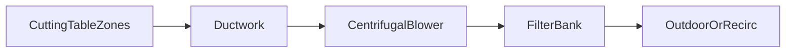

---
aliases:
  - laser fume extraction
  - dust extraction laser cutting
type: technical-reference
category: fume-extraction
applies_to: [fiber-laser, co2-laser]
source_reviewed: 2026-08-05
source_scope: IP Systems, GWK install checklist, ACMAN sizing guide
status: generic reference — verify against nameplate and project drawing
---

# Laser Fume Extraction Overview

Return to [[Technical Reference Index]]

> [!info] When to open this note
> System layout, capture methods, and why extraction is mandatory for metal laser cutting.

> [!danger] Health hazard
> Metal cutting fume contains fine particulate and oxides. Run extraction whenever the laser cuts; enclosure closed.

## What is generated

| Material | Fume character |
| --- | --- |
| Mild steel | Iron oxide particulate |
| Stainless | Chromium/nickel fine dust |
| Aluminum | Combustible fine dust — fire risk |
| Galvanized | **Zinc oxide** — special handling — [[Zn and Coated Material Fume Notes]] |
| Organics (CO₂) | VOCs, odors — carbon stage often required |

## System components

1. **Capture** — partitioned downdraft zones under slats
2. **Transport** — duct or hose to collector
3. **Fan** — centrifugal for high static pressure
4. **Filtration** — multi-stage — [[Filter Stages and Maintenance]]
5. **Discharge** — outside stack or filtered return per EHS

## Design principles

- Capture at source beats room ambient filtration
- **Static pressure** capability often matters more than free-blowing CFM rating
- Size for **loaded filters**, not clean-filter catalog number
- Minimize bends; long runs need larger duct — [[Ductwork and Static Pressure]]

## Installation checklist

1. Confirm OEM spigot size and required airflow at machine
2. Size collector — [[Dust Collector Sizing]]
3. Ground ductwork; bonded to machine where spec requires
4. Damper zones aligned with CNC zone control
5. Fire detection/suppression per local code for dry dust
6. Test airflow with doors closed before production

## Normal operation

- Fan starts with program or manual interlock
- Zone dampers open on active cut regions
- Visible smoke cleared within seconds at viewing window
- ΔP gauge in acceptable band

## Troubleshooting

| Symptom | Check |
| --- | --- |
| Smoke in cabinet | Fan off; clogged filter; damper stuck |
| Weak far zones | Undersized fan; leak in duct |
| Dust in office | Recirc filter inadequate; negative pressure lost |

## Related notes

- [[Fiber Laser Site Requirements]]
- [[Gweike 3015GAII 3 kW CypCut Cutting Parameter Setting]] — zinc fume callout

## Sources

- IP Systems laser fume extraction guide
- GWK installation checklist (ventilation phase)
- ACMAN laser cutting dust extraction sizing
