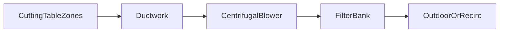

---
aliases:
  - laser fume extraction
  - dust extraction laser cutting
type: technical-reference
category: fume-extraction
applies_to: [fiber-laser, co2-laser]
source_reviewed: 2026-08-05
source_scope: IP Systems, GWK install checklist, ACMAN sizing guide
status: generic reference — verify against nameplate and project drawing
---

# Laser Fume Extraction Overview

Return to [[Technical Reference Index]]

> [!info] When to open this note
> System layout, capture methods, and why extraction is mandatory for metal (and organic) laser cutting.

> [!danger] Health hazard
> Metal cutting fume contains fine particulate and oxides. Run extraction whenever the laser cuts; enclosure closed.

## What is generated

| Material | Fume character |
| --- | --- |
| Mild steel | Iron oxide particulate |
| Stainless | Cr/Ni fine dust |
| Aluminum | Combustible fine dust — fire risk |
| Galvanized | **ZnO** — [[Zn and Coated Material Fume Notes]] |
| Organics (CO₂) | VOC/odor — carbon stage |

## System components

1. Capture — partitioned downdraft zones  
2. Transport — duct/hose — [[Ductwork and Static Pressure]]  
3. Fan — centrifugal for high static  
4. Filtration — [[Filter Stages and Maintenance]]  
5. Discharge — outdoor or filtered return per EHS  

## Design principles

- Capture at source beats ambient room filtration
- **Static pressure** capability often matters more than free-blowing CFM
- Size for **loaded** filters
- Minimize bends; long runs need larger duct
- Size volume — [[Dust Collector Sizing]]

## Installation checklist

1. OEM spigot size and required Q/P
2. Collector sized for materials and table
3. Bond/ground ductwork
4. Damper zones aligned with CNC
5. Fire/spark controls per code
6. Baseline ΔP, amps, smoke-clear time logged

## Normal operation

| Check | Pass |
| --- | --- |
| Fan on before pierce | Working negative pressure |
| Zone dampers track cut | Smoke clears quickly |
| ΔP in band | Filters not blinded |
| Enclosure closed | Especially on coated sheet |

## Troubleshooting

| Symptom | Check |
| --- | --- |
| Smoke in cabinet | Fan; filters; dampers; leaks |
| Weak far zones | Duct design / balance |
| Dust in office | Recirc filtration / pressure balance |
| Odor breakthrough | Carbon stage saturated |

## Related notes

- [[Fiber Laser Site Requirements]]
- [[Gweike 3015GAII 3 kW CypCut Cutting Parameter Setting]] — zinc callout
- [[CO2 vs Fiber Auxiliary Differences]] — VOC emphasis

## Sources

- IP Systems laser fume extraction guide
- GWK installation checklist (ventilation phase)
- ACMAN laser cutting dust extraction sizing
