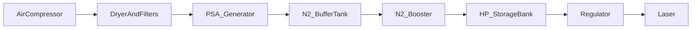

---
aliases:
  - PSA nitrogen generator
  - on-site nitrogen laser
type: technical-reference
category: nitrogen-systems
applies_to: [fiber-laser]
source_reviewed: 2026-08-05
source_scope: South-Tek laser cutting nitrogen systems reference
status: generic reference — verify against nameplate and project drawing
---

# PSA Nitrogen Generators

Return to [[Technical Reference Index]]

> [!info] When to open this note
> On-site nitrogen from compressed air — system layout, feed air quality, and generator operation.

## What PSA does

Pressure Swing Adsorption separates nitrogen from compressed air using carbon molecular sieve (CMS). Produces continuous N₂ at moderate pressure and purity; laser cutting usually needs **booster + HP storage** downstream for high-pressure assist.

## System layout

Detail: [[Nitrogen Booster and HP Storage]], [[Nitrogen System Pressure Setpoints]].

## Feed air requirements

| Parameter | Typical |
| --- | --- |
| Clean, dry compressed air | Same quality as good shop air — dryer mandatory |
| Discharge pressure | Generator needs stable feed — see OEM (often 7–10 bar class feed) |
| Oil content | Low — protect CMS beds |
| Temperature | Within OEM ambient range |

Poor feed air → CMS poisoned by oil/water → purity collapse.

## Generator operation (normal)

- Cycles between production and standby to hold buffer pressure
- Purity analyzer (if fitted) shows 4N+ when healthy
- Vent muffler on O₂-rich waste stream — ensure ventilation

## Installation checklist

1. Compressor sized for PSA + any air-cut load — [[Compressor Sizing by Laser Power]]
2. Treatment before PSA inlet
3. Buffer tank pressure band per project drawing
4. Booster and HP bank rated for peak cut pressure
5. Relief valves on all pressure zones
6. Purity verification before releasing laser production

## Troubleshooting preview

Full table: [[Nitrogen System Troubleshooting]].

| Symptom | First check |
| --- | --- |
| Low purity | Feed air quality; CMS age; leaks |
| Generator won't build pressure | Feed pressure low; valve stuck |
| High O₂ in product | Bed degradation; wrong cycle timing |

## Related notes

- [[Nitrogen Assist Gas]]
- [[Air Filtration Stages]]

## Sources

- South-Tek laser cutting nitrogen systems operation reference
