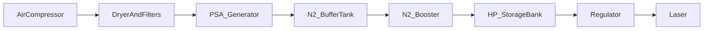

---
aliases:
  - PSA nitrogen generator
  - on-site nitrogen laser
type: technical-reference
category: nitrogen-systems
applies_to: [fiber-laser]
source_reviewed: 2026-08-05
source_scope: South-Tek laser cutting nitrogen systems reference
status: generic reference — verify against nameplate and project drawing
---

# PSA Nitrogen Generators

Return to [[Technical Reference Index]]

> [!info] When to open this note
> On-site nitrogen from compressed air — layout, feed-air quality, generator operation, and links to booster/HP stages.

## What PSA does

Pressure Swing Adsorption separates N₂ from compressed air using carbon molecular sieve (CMS). Produces continuous N₂ at moderate pressure/purity. Laser cutting usually needs **booster + HP storage** downstream for high-pressure assist — [[Nitrogen Booster and HP Storage]].

## System layout

Setpoints: [[Nitrogen System Pressure Setpoints]]. Faults: [[Nitrogen System Troubleshooting]].

## Feed air requirements

| Parameter | Typical |
| --- | --- |
| Clean dry air | Dryer mandatory |
| Stable feed pressure | Per OEM (often ~7–10 bar class) |
| Oil content | Very low — protect CMS |
| Temperature | Within OEM ambient |

Poor feed → CMS poisoned → purity collapse. Treatment train: [[Refrigerated Dryers]], [[Air Filtration Stages]].

## Generator operation — what good looks like

| Observation | Meaning |
| --- | --- |
| Cycles to hold buffer band | Normal |
| Purity ≥99.99% when cutting SS | Healthy |
| Waste O₂-rich vent audible pattern stable | Valves timing OK |
| No oil smell at inlet filter | Feed OK |

## Installation checklist

1. Compressor sized for PSA + any air-cut load — [[Compressor Sizing by Laser Power]]
2. Full treatment before PSA inlet
3. Buffer tank and relief valves
4. Booster + HP bank for cut pressure
5. Purity verification before SS production release
6. Ventilate waste vent
7. Log certificates / analyzer readings

## Troubleshooting preview

| Symptom | First check |
| --- | --- |
| Low purity | Feed air; CMS age; leaks |
| Won't build pressure | Feed pressure; inlet filter; valves |
| High O₂ in product | Beds; cycle timing |

Full table: [[Nitrogen System Troubleshooting]].

## Related notes

- [[Nitrogen Assist Gas]]
- [[Air Compressors for Laser Cutting]]
- [[Assist Gas Overview]]

## Sources

- South-Tek laser cutting nitrogen systems operation reference
