# Technical Reference Index

Return to [[Indepth Technology]].

> [!info] Purpose
> This is the **field referral system** for laser cutting and its auxiliary equipment. Open it when you have forgotten a spec, need to explain a subsystem to a customer, are diagnosing a fault that could sit in more than one system, or are planning a new install and want a checklist to work from. It is written for an installer or service technician standing at the machine, not for a classroom.

> [!warning] Generic reference only
> Every number in this library is a **typical industry range** synthesized from public OEM manuals, manufacturer installation guides, and field-service documentation. It is not a substitute for the nameplate, the project drawing, or the manufacturer's own manual for the exact machine in front of you. Where this library and the machine documentation disagree, the machine documentation wins.

## How to use this library

1. **Start broad, then drill down.** If you are new to a subsystem, open the category hub (e.g. [[Laser Water Chillers]]) before the deep troubleshooting note (e.g. [[CW Series Chiller Alarm Codes]]).
2. **Follow the alarm routing tables.** [[Fiber Laser Common Alarms]] and [[Height Sensor Alarm Reference]] point from the message on the screen to the correct deep-dive note.
3. **Cross the system, not just the component.** Faults often live between subsystems — a "height sensor" alarm can be a grounding fault ([[Grounding and EMC Isolation]]), and a "chiller" alarm can be a workshop humidity problem ([[Dew Point and Chiller Setpoints]]).
4. **Use the local machine pages for exact configuration.** This library never invents a value for a specific installed machine — it gives you the range to sanity-check against. The real answer lives on the machine hub note and in [[Cutting Parameters Index]].

## When to use this vs machine-specific notes

| Need | Use |
| --- | --- |
| Forgotten chiller alarm meaning, gas purity spec, bend radius rule, general troubleshooting order | This index and its notes |
| Exact CypCut recipe, installed head model, validated coupon result, specific machine history | [[Cutting Parameters Index]] and the relevant machine hub |
| Installation checklist for a specific job on site | [[Indepth Technology Machine Content/Installation Checklists/LaserCutter_Installation_Checklist.xlsx\|Laser cutter installation checklist]] plus the machine folder |
| Explaining a subsystem to a customer or apprentice | Category hub note (e.g. [[Fiber Laser Cutters]], [[Laser Fume Extraction Overview]]) |
| Planning a new machine or auxiliary purchase | [[Fiber Laser Power Classes]], [[Compressor Sizing by Laser Power]], [[Dust Collector Sizing]] |

## Status legend

- **Generic reference:** not tied to one installed machine; ranges and procedures require local verification before being applied.
- **Cross-links to local machines** are provided in each note's Related/Local Machines section where relevant, but they do not replace the machine's own commissioning record.
- Frontmatter `source_reviewed` shows when a note was last checked against its cited sources; re-verify anything older than a couple of years against current OEM literature, since chiller and PSA product lines change.

## Full subsystem map

```mermaid
flowchart TD
    hub[TechnicalReferenceIndex]
    hub --> fiber[FiberLaserCutters]
    hub --> co2[CO2LaserCutters]
    hub --> gas[AssistGasOverview]
    hub --> comp[AirCompressorsForLaserCutting]
    hub --> n2[PSANitrogenGenerators]
    hub --> chill[LaserWaterChillers]
    hub --> env[WorkshopHumidityAndCondensation]
    hub --> fume[LaserFumeExtractionOverview]
    hub --> fiberOpt[QBHFiberDeliveryCable]
    hub --> head[CapacitiveHeightSensingBCS100]
    hub --> pneu[PneumaticCylindersInLaserSystems]
    hub --> elec[LaserElectricalSupplyRequirements]
    fiber --> fiberPower[FiberLaserPowerClasses]
    fiber --> fiberSite[FiberLaserSiteRequirements]
    fiber --> fiberSeq[FiberLaserCommissioningSequence]
    fiber --> fiberAlarm[FiberLaserCommonAlarms]
    gas --> o2[OxygenAssistGas]
    gas --> n2gas[NitrogenAssistGas]
    gas --> airCut[CompressedAirCutting]
    comp --> screw[ScrewVsPistonCompressors]
    comp --> dryer[RefrigeratedDryers]
    comp --> filt[AirFiltrationStages]
    n2 --> boost[NitrogenBoosterAndHPStorage]
    n2 --> setp[NitrogenSystemPressureSetpoints]
    chill --> dual[DualTemperatureChillerCircuits]
    chill --> water[CoolingWaterQuality]
    chill --> alarm[CWSeriesChillerAlarmCodes]
    env --> dehum[DehumidifiersForLaserRooms]
    env --> dew[DewPointAndChillerSetpoints]
    fume --> size[DustCollectorSizing]
    fume --> duct[DuctworkAndStaticPressure]
    fiberOpt --> bend[FiberCableBendRadiusAndRouting]
    fiberOpt --> clean[FiberConnectorCleaningAndInspection]
    head --> alarmH[HeightSensorAlarmReference]
    head --> nozzle[CuttingHeadNozzlesAndCeramics]
    pneu --> nozzleChg[NozzleChangeAndShutterActuators]
    pneu --> frl[FRLUnitsAndShopAirPlumbing]
    elec --> ground[GroundingAndEMCIsolation]
    elec --> clear[InstallationClearancesAndFoundations]
```

---

## Laser types

### Fiber lasers

- [[Fiber Laser Cutters]] — core hub, subsystem map, power-class comparison
- [[Fiber Laser Power Classes]] — 1–3 kW / 4–6 kW / 8–12 kW+ electrical, gas, chiller, and extraction comparisons
- [[Fiber Laser Site Requirements]] — pre-install survey checklist
- [[Fiber Laser Commissioning Sequence]] — ordered bring-up from mechanical install to first validated coupon
- [[Fiber Laser Common Alarms]] — alarm-to-subsystem routing map

### CO2 lasers

- [[CO2 Laser Cutters]] — core hub and subsystem map
- [[CO2 vs Fiber Auxiliary Differences]] — side-by-side auxiliary comparison for installers crossing technologies
- [[CO2 Chiller and Gas Requirements]] — resonator cooling and laser-gas mix

---

## Assist gas

- [[Assist Gas Overview]] — choosing O₂, N₂, or air; purity, pressure, and gas-path diagram
- [[Oxygen Assist Gas]] — carbon-steel exothermic cutting
- [[Nitrogen Assist Gas]] — stainless and bright-edge cutting
- [[Compressed Air Cutting]] — cost-effective assist for suitable thin sheet
- [[Gas Regulators and PRVs]] — regulator selection, setting, and diagnosis
- [[Gas Pipework and Fittings]] — materials, routing, leak testing, labeling

---

## Air compressors

- [[Air Compressors for Laser Cutting]] — system block diagram and requirements summary
- [[Screw vs Piston Compressors]] — technology comparison for laser air cutting
- [[Refrigerated Dryers]] — mandatory drying stage
- [[Air Filtration Stages]] — filter chain order and ISO 8573-1 targets
- [[Compressor Sizing by Laser Power]] — kW and flow planning by laser class

---

## Nitrogen generation (PSA)

- [[PSA Nitrogen Generators]] — on-site nitrogen production system layout
- [[Nitrogen Booster and HP Storage]] — boosting PSA output to cutting pressure
- [[Nitrogen System Pressure Setpoints]] — typical cut-in/cut-out bands along the plant
- [[Nitrogen System Troubleshooting]] — symptom-based diagnosis end to end

---

## Chillers and cooling water

- [[Laser Water Chillers]] — function, connection convention, fill and commissioning
- [[Dual-Temperature Chiller Circuits]] — Lo/Hi loop concept and why the head runs warmer
- [[Cooling Water Quality]] — approved water types, conductivity, change interval
- [[Antifreeze and Winter Operation]] — glycol mixes and cold-shop operation
- [[CW Series Chiller Alarm Codes]] — E1–E6 decode with bypass-test procedure
- [[Chiller Troubleshooting Flowchart]] — decision-tree diagnosis

---

## Environment and condensation

- [[Workshop Humidity and Condensation]] — mechanism, damage sites, prevention hierarchy
- [[Dehumidifiers for Laser Rooms]] — sizing and placement
- [[Ambient Temperature Limits]] — workshop and laser-zone temperature targets
- [[Dew Point and Chiller Setpoints]] — the core anti-condensation calculation and rule

---

## Fume extraction

- [[Laser Fume Extraction Overview]] — system layout and design principles
- [[Dust Collector Sizing]] — airflow formula and table-width sizing hints
- [[Ductwork and Static Pressure]] — duct design rules and velocity targets
- [[Filter Stages and Maintenance]] — filter types, change indicators, safe change procedure
- [[Zn and Coated Material Fume Notes]] — galvanized and coated-sheet fume controls

---

## Fiber delivery optics

- [[QBH Fiber Delivery Cable]] — connector specification and mating procedure
- [[Fiber Cable Bend Radius and Routing]] — minimum radius rules and drag-chain practice
- [[Fiber Connector Cleaning and Inspection]] — cleanroom discipline for high-power interfaces
- [[Fiber Cable Cooling and Interlocks]] — QBH water flow, interlock circuit, thermoswitch

---

## Cutting head and height control

- [[Capacitive Height Sensing BCS100]] — principle, signal path, calibration procedure
- [[Height Sensor Alarm Reference]] — alarm text to cause to fix, in shop-floor order
- [[Cutting Head Nozzles and Ceramics]] — nozzle families, ceramic ring, spares kit
- [[Autofocus and Proportional Gas Valves]] — motorized focus and pressure control

---

## Pneumatics

- [[Pneumatic Cylinders in Laser Systems]] — where cylinders appear and sizing basics
- [[Nozzle Change and Shutter Actuators]] — automatic nozzle changer and beam shutter service
- [[FRL Units and Shop Air Plumbing]] — control air vs cutting air separation

---

## Electrical, grounding, and site

- [[Laser Electrical Supply Requirements]] — three-phase supply, capacity planning, dedicated circuits
- [[Grounding and EMC Isolation]] — protective earth, ground resistance, EMI mitigation
- [[Installation Clearances and Foundations]] — floor loading, clearances, layout, relocation checklist

---

## Local machines (machine-specific)

- [[Gweike 3015GAII]] — 3 kW stated, CypCut, Raycus source
- [[Gweike 4020GA]]
- [[JQ-2040E]]
- [[JQ-2060E]]

## Related indexes

- [[Cutting Parameters Index]] — machine-specific recipes, commissioning status, and validated production records
