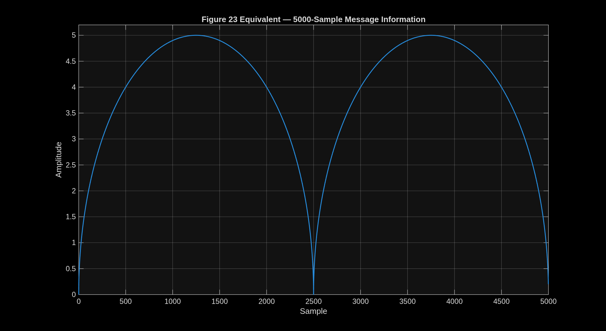
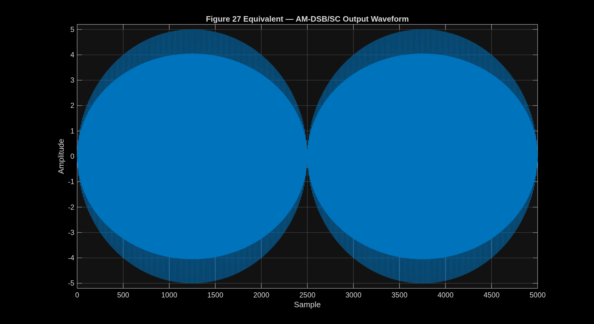
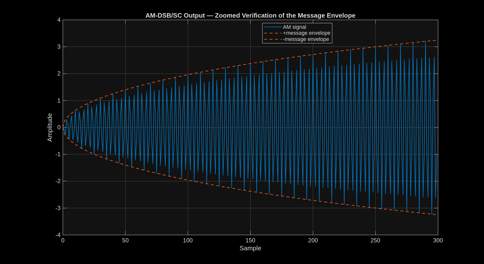
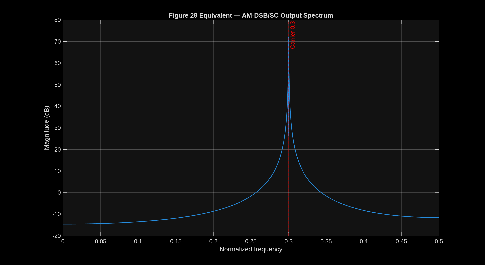

# ENEL700 Lab 5 Report — Amplitude Modulation Using MATLAB

Return to [[Communication Engineering Overview]] · [[Lab 5 - MATLAB Replication Report.pdf|Open the shareable PDF]] · Lab instructions: [[Mechatronics Course Content/Communication Engineering/Assessments/Labs/Lab 5/Lab 5 Artifacts/Lab 5 - Amplitude Modulation Using Simulink|Lab 5 working note]] · Source: [[Mechatronics Course Content/Communication Engineering/Assessments/Labs/ENEL700 Lab Book 2026.pdf#page=30|ENEL700 Lab Book 2026, pages 30–38]] · Accessible text: [[ENEL700-Lab-5-Full-Transcription]]

## Abstract

This work replicated the signal processing and output figures from ENEL700 Lab 5, *Amplitude Modulation Using Simulink*. The supplied laboratory procedure defines a 5,000-sample two-arch message signal, a unit-amplitude carrier at normalized frequency 0.3, and an AM double-sideband suppressed-carrier (AM-DSB/SC) signal formed by multiplication. Headless Simulink initialization did not complete within bounded safety limits, so the same signals were generated and analysed directly in MATLAB. The resulting message waveform, modulated waveform, output spectrum, and three stacked spectra matched the forms shown in manual Figures 23, 27, 28, and 29. The measured modulated-sideband/message peak ratio was 0.4984, corresponding to −3.0245 dB under the manual's `10*log10` convention, in close agreement with the expected 0.5 and −3 dB.

## 1. Objective

The purpose of Lab 5 is to become familiar with MATLAB and Simulink through an amplitude-modulation example. The practical objectives are to:

- create a 5,000-sample message waveform;
- multiply the message by a sinusoidal carrier to form AM-DSB/SC;
- inspect the time-domain waveform and output spectrum;
- write the Question 1 `sigspec.m` spectrum function;
- use `sigspec.m` and `subplot` to compare the message, carrier, and modulated spectra;
- verify the expected one-half linear scaling, equivalent to approximately −3 dB under the lab's logarithmic convention.

## 2. Source reconstruction

Manual pages 30–38 were rendered and visually transcribed page-by-page because the Lab 5 section of the PDF is image-based and does not contain searchable text. The complete accessible transcription is stored in [[ENEL700-Lab-5-Full-Transcription]]. It confirms that Question 2 depends on both the initial model setup and Question 1's supplied spectrum function.

The relevant sequence is:

1. Define the message `bumps` in MATLAB.
2. Configure the carrier as a time-based Sine Wave with frequency `2*pi*0.3`, phase `pi/2`, and sample time `1`.
3. Multiply the message and carrier.
4. Export the modulated signal as `am`.
5. Complete the Question 1 `sigspec.m` function using a Hamming window, zero-padded FFT, `fftshift`, and normalized frequency from −0.5 to 0.5.
6. For Question 2, export the carrier and use the same `sigspec.m` function in three subplot axes.

## 3. Theory

For discrete sample index \(n\), the carrier used by the manual is

\[
c[n] = \sin(2\pi(0.3)n + \pi/2).
\]

The message is the two-arch sequence

```matlab
bump = sqrt(1250^2-([0:2499]-1250).^2) / 250;
bumps = [bump bump];
```

The AM-DSB/SC output is

\[
s[n] = m[n]c[n].
\]

Multiplication by a sinusoidal carrier shifts the baseband message spectrum to positive and negative carrier frequencies. Since

\[
\cos(2\pi f_c n) = \frac{1}{2}e^{j2\pi f_c n}+\frac{1}{2}e^{-j2\pi f_c n},
\]

each shifted copy has one-half of the original linear spectral magnitude. With the laboratory function's `10*log10` magnitude convention,

\[
10\log_{10}(0.5) \approx -3.01\text{ dB}.
\]

## 4. MATLAB method

The direct MATLAB replication used the same parameters as the manual:

- message length: 5,000 samples;
- message maximum amplitude: 5;
- carrier amplitude: 1;
- normalized carrier frequency: 0.3;
- carrier phase: \(\pi/2\);
- sample interval: 1;
- modulated output: `message .* carrier`.

### 4.1 Manual Figure 28 spectrum method

The output spectrum equivalent used the manual's Blackman-window and `20*log10` procedure with `NFFT = 2^16`.

### 4.2 Question 1 `sigspec.m`

The completed [[sigspec.m]] follows the supplied Question 1 processing sequence:

- force signals into columns;
- apply a Hamming window;
- use a zero-padded FFT size of `2^(ceil(log2(len))+2)`;
- centre the spectrum with `fftshift`;
- use normalized frequency `[-0.5, 0.5)`;
- plot linear magnitude for `flag=0`;
- plot `10*log10` magnitude for `flag=1`.

The manual starter labels the y-axis “Magnitude (dB)” even for the linear branch. The completed function corrects only that label: the linear branch is labelled “Linear magnitude.” The numerical algorithm remains the manual's method.

## 5. Results

### 5.1 Message information — manual Figure 23 equivalent

The generated message contains exactly 5,000 finite real samples. It forms two arches, rises to amplitude 5, and returns close to zero at the midpoint and end.



### 5.2 AM-DSB/SC waveform — manual Figure 27 equivalent

The full output shows rapid carrier oscillation bounded by the two-arch envelope, with maximum absolute amplitude 5. This matches the expected output of multiplying the message by a unit-amplitude carrier.



The zoomed result makes the carrier oscillations and positive/negative message envelope easier to inspect.



### 5.3 Output spectrum — manual Figure 28 equivalent

The dominant positive-frequency spectral peak was measured at normalized frequency `0.300003051758`, matching the configured carrier frequency of 0.3.



## 6. Question 1 — spectrum function

The supplied starter code was completed as [[sigspec.m]]. The function successfully produced centred linear and logarithmic spectra for vectors supplied as either rows or columns. Optional frequency and spectrum outputs were retained for numerical verification; calling the function without outputs still performs the required plot.

## 7. Question 2 — three spectra

Question 2 requires three signals in the same figure window but in separate subplot axes:

1. **Modulating signal:** baseband spectrum centred at normalized frequency 0.
2. **Carrier signal:** narrow symmetric peaks at approximately −0.3 and +0.3.
3. **Modulated signal:** shifted copies of the message spectrum centred around −0.3 and +0.3, with no separate unsuppressed carrier term.

### 7.1 Logarithmic spectra


### 7.2 Linear spectra


### 7.3 Scaling measurement

The Hamming-windowed, zero-padded spectra produced:

- message-spectrum peak: reference value;
- average positive/negative modulated-sideband peak divided by message peak: `0.498366330964`;
- expected linear ratio: `0.5`;
- measured logarithmic difference: `−3.02451305776 dB`;
- expected logarithmic difference: approximately `−3.01 dB`;
- measured carrier peak frequency: `0.299987792969`.

The small difference from exactly 0.5 is consistent with finite-length sampling, windowing, and FFT-bin placement. The result supports the expected AM-DSB/SC scaling.

## 8. Validation against the laboratory manual

| Manual requirement | MATLAB replication result | Status |
| --- | --- | --- |
| 5,000-sample two-arch message | 5,000 samples, amplitude 0–5 | Pass |
| Unit-amplitude carrier at normalized frequency 0.3 | Peak measured at 0.299988/0.300003 depending on FFT method | Pass |
| AM waveform follows message envelope | Full and zoomed plots visually verified | Pass |
| Output spectrum shifted to 0.3 | Dominant peak at 0.300003 | Pass |
| Question 1 uses Hamming, zero-padding, `fftshift` | Completed `sigspec.m` uses the supplied sequence | Pass |
| Three stacked spectra | Message, carrier, and modulated spectra produced | Pass |
| Modulated spectrum is half the message magnitude | Ratio 0.498366 | Pass |
| Log difference is about −3 dB | −3.0245 dB | Pass |

## 9. Completing the laboratory exactly in Simulink — Aaron-assisted handoff

The signal processing and required output figures are certified, but the current work is a MATLAB signal-domain replication rather than an executed Simulink block model. MATLAB itself works normally and reports a valid Simulink licence; however, headless `load_system('simulink')` did not return within a 30-second safety limit, and a minimal model attempt did not return within 60 seconds. Both were terminated automatically to avoid leaving an unattended prompt or process.

To complete the procedure exactly as written in the manual, Aaron would need to help at Tornado with the GUI-dependent stage:

1. Open the MATLAB desktop and launch Simulink manually.
2. Respond to any first-run, licence, update, graphics, or external-application dialogue that appears. Credentials, MFA codes, and passwords should remain private and be entered only by Aaron.
3. If AUT has supplied a newer Lab 5 or Simulink instruction link than the older links printed on manual page 30, open or provide that current source so its block names and steps can be checked before submission.
4. Confirm that the current release can locate the required blocks or their modern equivalents:
   - Signal From Workspace
   - Sine Wave
   - Product
   - Scope
   - To Workspace
5. Build or verify `lab5.slx` with the exact parameters recorded in [[ENEL700-Lab-5-Full-Transcription]].
6. Add the second To Workspace block required by Question 2 and name the carrier output clearly.
7. Run the model with stop time 5000 and a fixed-step solver.
8. Save screenshots of the actual block diagram and Scope display, and export the real message, carrier, and modulated workspace arrays.
9. Rerun [[run_lab5_question2_three_spectra.m]] using those exported arrays instead of the direct MATLAB equivalents, then compare the results with this report.

This handoff would certify the Simulink GUI implementation itself. The present report already certifies the underlying signal definitions, spectrum function, expected figures, and Question 2 scaling.

## 10. Limitations

- A `.slx` model was not produced because unattended Simulink initialization stalled.
- The report figures were generated directly from the manual's signal equations in MATLAB, not captured from the Simulink Scope.
- The mathematical operation is equivalent to the intended Product block, but a future GUI run is still required if assessment evidence must show an actual Simulink diagram and Scope window.
- The manual uses `20*log10` for Figure 28 but `10*log10` in the Question 1 `sigspec` starter. This report preserves both conventions in their respective contexts rather than silently treating them as identical.

## 11. Conclusion

The MATLAB replication successfully reproduced the central results of ENEL700 Lab 5. The two-arch message, AM-DSB/SC waveform, carrier-frequency shift, completed spectrum function, and three stacked Question 2 spectra all matched the laboratory instructions. Numerical verification measured the carrier at approximately 0.3 and the sideband scaling at 0.4984 or −3.0245 dB, agreeing closely with theory. The remaining work for a fully literal completion is a supervised Simulink GUI run and capture of the actual block-model and Scope evidence.

## Appendix — reproducibility files

- [[sigspec.m]] — completed Question 1 function
- [[run_lab5_question2_three_spectra.m]] — Question 2 execution and assertions
- [[generate_lab5_report_figures.m]] — report figure generator
- [[lab5_question2_status.txt]] — certified Question 2 values
- [[report_figure_status.txt]] — report figure verification values
- [[ENEL700-Lab-5-Full-Transcription]] — accessible transcription of manual pages 30–38
