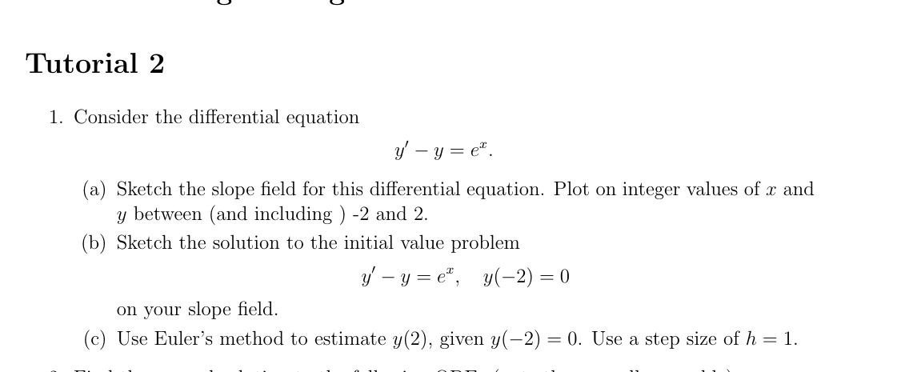
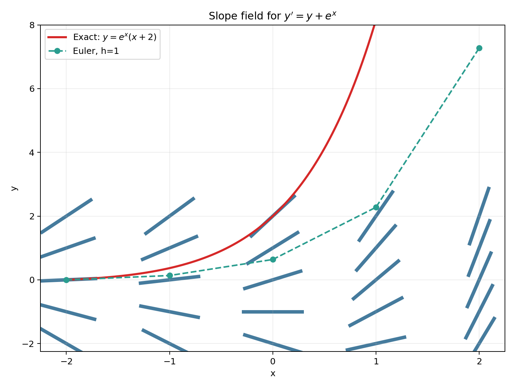
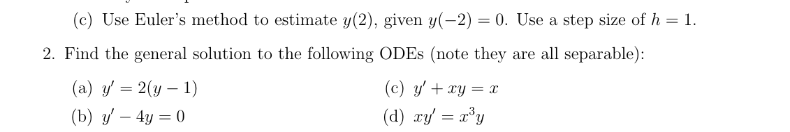
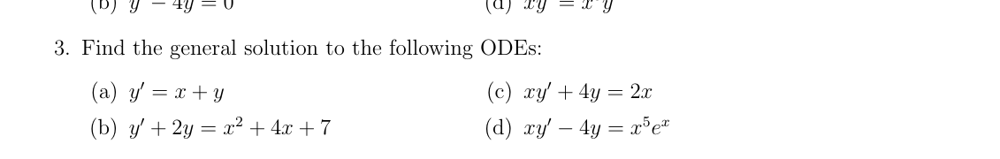
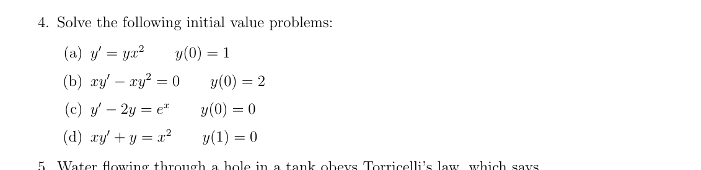
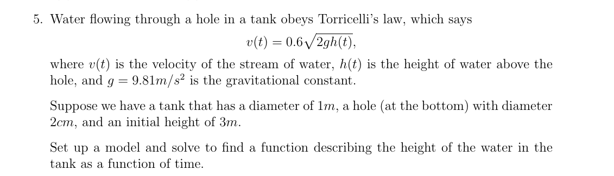
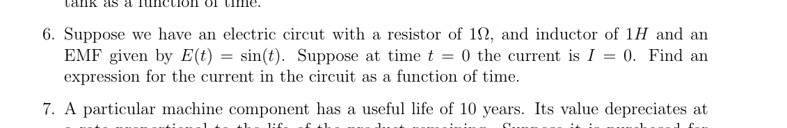
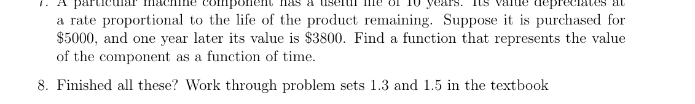
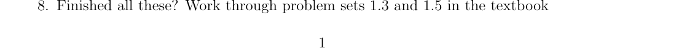

# ENGE702 Engineering Mathematics III — Tutorial 2

> [!note] Scope and verification
> These are complete worked solutions to Questions 1–7 from the locally stored Tutorial 2 sheet. Question 8 is an instruction to continue with textbook exercises rather than a defined problem. The differential-equation residuals and initial conditions were checked symbolically; numerical results were independently recomputed.

## Question 1 — Slope field, exact IVP solution, and Euler’s method

The differential equation is

$$
y'-y=e^x,
$$

so the slope function is

$$
y'=f(x,y)=y+e^x.
$$

### (a) Slope field

At each integer grid point $(x,y)$, the short line segment has slope $y+e^x$. For example,

$$
f(-2,0)=e^{-2}\approx0.1353,
\qquad
f(0,0)=1,
\qquad
f(2,0)=e^2\approx7.389.
$$

The field, exact IVP solution, and Euler polygon are shown below.

### (b) Exact solution through $(-2,0)$

Write the ODE in linear form:

$$
y'-y=e^x.
$$

The integrating factor is

$$
\mu(x)=e^{\int -1\,dx}=e^{-x}.
$$

Multiplying through by $e^{-x}$,

$$
e^{-x}y'-e^{-x}y=1,
$$

and the left-hand side is a product derivative:

$$
\frac{d}{dx}\left(e^{-x}y\right)=1.
$$

Integrating,

$$
e^{-x}y=x+C,
$$

so

$$
y=e^x(x+C).
$$

Apply $y(-2)=0$:

$$
0=e^{-2}(-2+C) \quad\Longrightarrow\quad C=2.
$$

Therefore,

$$
\boxed{y(x)=e^x(x+2)}.
$$

### (c) Euler estimate of $y(2)$, with $h=1$

Euler’s update is

$$
y_{n+1}=y_n+h\left(y_n+e^{x_n}\right).
$$

Starting from $(x_0,y_0)=(-2,0)$:

| $n$ | $x_n$ | $y_n$ | $f(x_n,y_n)=y_n+e^{x_n}$ | $y_{n+1}$ |
|---:|---:|---:|---:|---:|
| 0 | -2 | 0.000000 | 0.135335 | 0.135335 |
| 1 | -1 | 0.135335 | 0.503215 | 0.638550 |
| 2 | 0 | 0.638550 | 1.638550 | 2.277100 |
| 3 | 1 | 2.277100 | 4.995382 | 7.272482 |

Thus,

$$
\boxed{y(2)\approx7.27248\text{ by Euler's method}.}
$$

For comparison, the exact value is

$$
y(2)=4e^2\approx29.5562.
$$

The large difference reflects the coarse step size and the rapidly increasing solution.

## Question 2 — Separable ODEs

### (a) $y'=2(y-1)$

Separate variables:

$$
\frac{dy}{y-1}=2\,dx.
$$

Integrate:

$$
\ln|y-1|=2x+C.
$$

Exponentiating and absorbing the sign into the constant,

$$
y-1=Ce^{2x}.
$$

Therefore,

$$
\boxed{y=1+Ce^{2x}}.
$$

### (b) $y'-4y=0$

Since $y'=4y$,

$$
\frac{dy}{y}=4\,dx.
$$

Hence

$$
\ln|y|=4x+C,
$$

and

$$
\boxed{y=Ce^{4x}}.
$$

### (c) $y'+xy=x$

Rearrange:

$$
y'=x(1-y).
$$

Separate and integrate:

$$
\frac{dy}{1-y}=x\,dx,
$$

$$
-\ln|1-y|=\frac{x^2}{2}+C.
$$

Therefore,

$$
1-y=Ce^{-x^2/2},
$$

and, after renaming the arbitrary constant,

$$
\boxed{y=1+Ce^{-x^2/2}}.
$$

### (d) $xy'=x^3y$

For $x\neq0$, divide by $x$:

$$
y'=x^2y.
$$

Then

$$
\frac{dy}{y}=x^2\,dx,
$$

so

$$
\ln|y|=\frac{x^3}{3}+C.
$$

Thus,

$$
\boxed{y=Ce^{x^3/3}}.
$$

The formula also includes the zero solution when $C=0$.

## Question 3 — First-order linear ODEs

### (a) $y'=x+y$

Write

$$
y'-y=x.
$$

The complementary solution is $y_c=Ce^x$. Try a particular solution $y_p=ax+b$. Substitution gives

$$
a-(ax+b)=x,
$$

so $a=-1$ and $b=-1$. Therefore,

$$
\boxed{y=Ce^x-x-1}.
$$

### (b) $y'+2y=x^2+4x+7$

The complementary solution is $y_c=Ce^{-2x}$. Let

$$
y_p=Ax^2+Bx+D.
$$

Then

$$
y_p'+2y_p
=2Ax+B+2Ax^2+2Bx+2D.
$$

Match coefficients with $x^2+4x+7$:

$$
2A=1,
\qquad
2A+2B=4,
\qquad
B+2D=7.
$$

This gives

$$
A=\frac12,
\qquad
B=\frac32,
\qquad
D=\frac{11}{4}.
$$

Hence,

$$
\boxed{y=Ce^{-2x}+\frac{x^2}{2}+\frac{3x}{2}+\frac{11}{4}}.
$$

### (c) $xy'+4y=2x$

For $x\neq0$, divide by $x$:

$$
y'+\frac4x y=2.
$$

On any interval not crossing $x=0$, an integrating factor is

$$
\mu(x)=e^{\int 4/x\,dx}=x^4.
$$

Therefore,

$$
\frac{d}{dx}(x^4y)=2x^4.
$$

Integrating,

$$
x^4y=\frac{2x^5}{5}+C,
$$

so

$$
\boxed{y=\frac{2x}{5}+\frac{C}{x^4}},
\qquad x\neq0.
$$

### (d) $xy'-4y=x^5e^x$

For $x\neq0$,

$$
y'-\frac4x y=x^4e^x.
$$

The integrating factor is

$$
\mu(x)=e^{\int -4/x\,dx}=x^{-4}.
$$

Thus,

$$
\frac{d}{dx}(x^{-4}y)=e^x.
$$

Integrating,

$$
x^{-4}y=e^x+C.
$$

Therefore,

$$
\boxed{y=x^4(e^x+C)}.
$$

## Question 4 — Initial-value problems

### (a) $y'=yx^2,\;y(0)=1$

Separate and integrate:

$$
\frac{dy}{y}=x^2\,dx,
$$

$$
\ln|y|=\frac{x^3}{3}+C.
$$

Therefore $y=Ae^{x^3/3}$. Applying $y(0)=1$ gives $A=1$, hence

$$
\boxed{y=e^{x^3/3}}.
$$

### (b) $xy'-xy^2=0,\;y(0)=2$

For $x\neq0$, divide by $x$:

$$
y'=y^2.
$$

Separate variables:

$$
y^{-2}\,dy=dx.
$$

Integrating,

$$
-\frac1y=x+C.
$$

Equivalently,

$$
y=\frac{1}{K-x}.
$$

Using $y(0)=2$ gives $K=1/2$. Therefore,

$$
\boxed{y=\frac{2}{1-2x}}.
$$

The solution is valid on the maximal interval containing the initial point, $x<1/2$. Although the original equation degenerates at $x=0$, the displayed function is differentiable there and satisfies the stated condition.

### (c) $y'-2y=e^x,\;y(0)=0$

Use the integrating factor $e^{-2x}$:

$$
\frac{d}{dx}(e^{-2x}y)=e^{-x}.
$$

Integrating,

$$
e^{-2x}y=-e^{-x}+C,
$$

so

$$
y=-e^x+Ce^{2x}.
$$

Apply $y(0)=0$: $0=-1+C$, hence $C=1$. Therefore,

$$
\boxed{y=e^{2x}-e^x}.
$$

### (d) $xy'+y=x^2,\;y(1)=0$

Recognise a product derivative:

$$
\frac{d}{dx}(xy)=x^2.
$$

Integrating,

$$
xy=\frac{x^3}{3}+C.
$$

Thus

$$
y=\frac{x^2}{3}+\frac{C}{x}.
$$

Apply $y(1)=0$:

$$
0=\frac13+C,
$$

so $C=-1/3$. Therefore,

$$
\boxed{y=\frac{x^3-1}{3x}},
\qquad x>0.
$$

## Question 5 — Draining tank using Torricelli’s law

The tank radius is $R=0.5\,\mathrm{m}$, so its cross-sectional area is

$$
A_T=\pi R^2=0.25\pi\ \mathrm{m^2}.
$$

The hole radius is $r=0.01\,\mathrm{m}$, giving

$$
A_h=\pi r^2=0.0001\pi\ \mathrm{m^2}.
$$

The outflow speed is

$$
v=0.6\sqrt{2gh}.
$$

Volume conservation gives

$$
A_T\frac{dh}{dt}=-A_hv.
$$

Therefore,

$$
\frac{dh}{dt}
=-0.6\frac{A_h}{A_T}\sqrt{2g}\sqrt{h}.
$$

Because

$$
\frac{A_h}{A_T}=\frac{0.0001\pi}{0.25\pi}=0.0004,
$$

and $g=9.81\,\mathrm{m/s^2}$, define

$$
k=0.6(0.0004)\sqrt{2(9.81)}
=0.001063067\ \mathrm{m^{1/2}/s}.
$$

The model is

$$
\frac{dh}{dt}=-k\sqrt h,
\qquad h(0)=3.
$$

Separate and integrate:

$$
\frac{dh}{\sqrt h}=-k\,dt,
$$

$$
2\sqrt h=-kt+C.
$$

From $h(0)=3$, $C=2\sqrt3$. Hence

$$
\sqrt h=\sqrt3-\frac{k}{2}t,
$$

and the water height is

$$
\boxed{h(t)=\left(\sqrt3-0.0005315336\,t\right)^2\ \mathrm{m}}.
$$

This applies until the tank empties. Setting $h=0$,

$$
t_{\mathrm{empty}}=\frac{2\sqrt3}{k}
\approx3258.59\ \mathrm{s}
\approx54.31\ \mathrm{min}.
$$

For later times the physical model is $h(t)=0$.

## Question 6 — RL electric circuit

Kirchhoff’s voltage law for a series resistor-inductor circuit is

$$
L\frac{dI}{dt}+RI=E(t).
$$

With $L=1\,\mathrm{H}$, $R=1\,\Omega$, and $E(t)=\sin t$,

$$
I'+I=\sin t.
$$

Use integrating factor $e^t$:

$$
\frac{d}{dt}(e^tI)=e^t\sin t.
$$

Since

$$
\int e^t\sin t\,dt
=\frac{e^t}{2}(\sin t-\cos t),
$$

we obtain

$$
I=\frac12(\sin t-\cos t)+Ce^{-t}.
$$

Apply $I(0)=0$:

$$
0=-\frac12+C,
$$

so $C=1/2$. Therefore,

$$
\boxed{I(t)=\frac12\left(\sin t-\cos t+e^{-t}\right)\ \mathrm{A}}.
$$

## Question 7 — Depreciation model

Let $V(t)$ be the component value in dollars, with $t$ measured in years after purchase. The remaining life is $10-t$. Interpreting “depreciates at a rate proportional to the life remaining” gives

$$
\frac{dV}{dt}=-k(10-t),
\qquad k>0.
$$

Integrating,

$$
V(t)=C-k\left(10t-\frac{t^2}{2}\right).
$$

Since $V(0)=5000$, $C=5000$. Use $V(1)=3800$:

$$
3800=5000-k\left(10-\frac12\right),
$$

$$
1200=9.5k,
$$

$$
k=\frac{2400}{19}\approx126.3158.
$$

Thus,

$$
\boxed{V(t)=5000-\frac{2400}{19}\left(10t-\frac{t^2}{2}\right)}.
$$

An equivalent form is

$$
\boxed{V(t)=5000-\frac{1200}{19}(20t-t^2)}.
$$

This is the mathematical result from the wording and the two supplied values. It predicts a negative value before the stated ten-year life ends, so a practical valuation model would impose a minimum salvage value or use a different depreciation law.

If the sheet intended to say that the depreciation rate is proportional to the **value remaining** rather than the **life remaining**, the standard exponential model would instead be

$$
V(t)=5000(0.76)^t,
$$

because $V(1)/V(0)=3800/5000=0.76$. The wording should therefore be confirmed with the lecturer; the boxed quadratic model above follows the text exactly.

## Question 8 — Further study instruction

Question 8 does not provide additional equations to solve. It directs students who have completed the tutorial to work through textbook problem sets 1.3 and 1.5. Those textbook questions are not included in the local tutorial sheet, so no extra problems have been invented here.

## Final answers at a glance

- **1(b):** $y=e^x(x+2)$.
- **1(c):** Euler estimate $y(2)\approx7.27248$ for $h=1$.
- **2:** $1+Ce^{2x}$, $Ce^{4x}$, $1+Ce^{-x^2/2}$, $Ce^{x^3/3}$.
- **3:** $Ce^x-x-1$; $Ce^{-2x}+x^2/2+3x/2+11/4$; $2x/5+C/x^4$; $x^4(e^x+C)$.
- **4:** $e^{x^3/3}$; $2/(1-2x)$; $e^{2x}-e^x$; $(x^3-1)/(3x)$.
- **5:** $h(t)=(\sqrt3-0.0005315336t)^2\,\mathrm{m}$, until $t\approx3258.59\,\mathrm{s}$.
- **6:** $I(t)=\tfrac12(\sin t-\cos t+e^{-t})\,\mathrm{A}$.
- **7:** $V(t)=5000-\tfrac{1200}{19}(20t-t^2)$.
