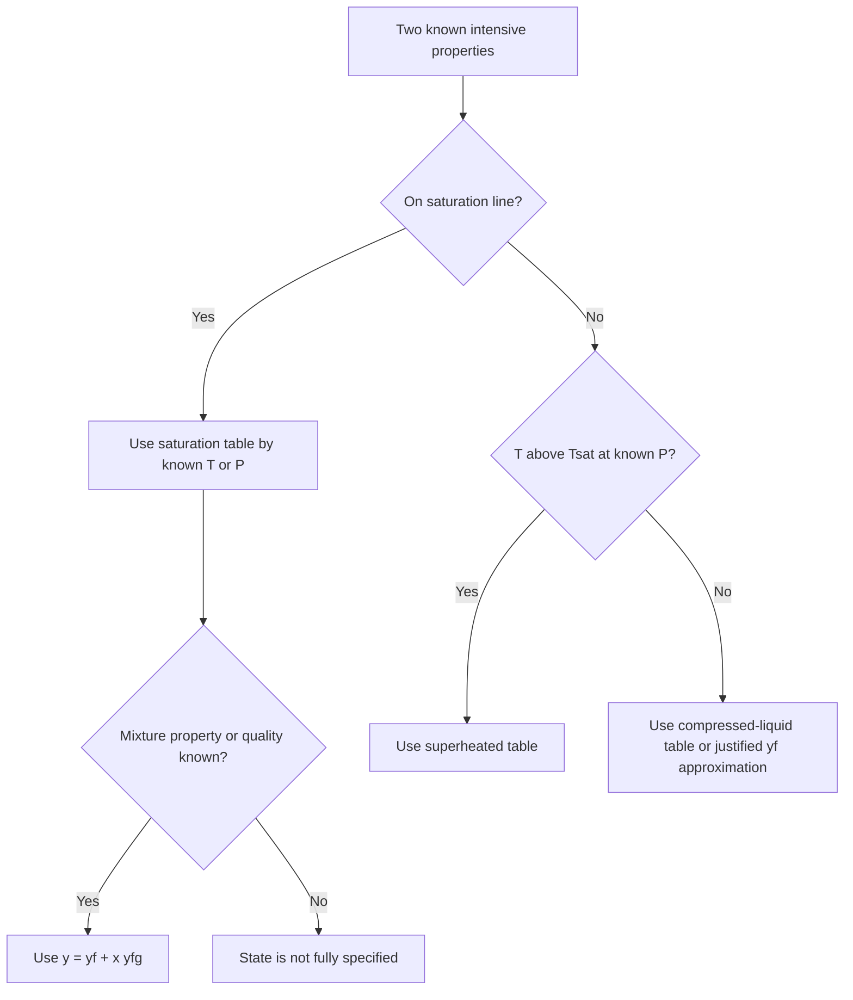

---
aliases:
  - ENME601 Week 3
  - Properties of Pure Substances
lecture: 3
source: L3 Properties of pure substances.pdf
source_reviewed: 2026-07-30
source_scope: Lecture 3, current Week 3 slides, property tables, saturation and superheated table workflow, and current saturation-lab questions and solutions
---

# Properties and Phase Change of Pure Substances

> [!info] Course navigation
> [[Thermodynamics Overview|Subject overview]] - [[Thermodynamics Roadmap|Course roadmap]] - [[Thermodynamics Practice Index|Practice index]] - [[Thermodynamics Reference Index|References]] - Previous: [[Energy Transfer and the First Law]] - Next: [[Closed-System Energy Analysis]]
>
> [[L3 Properties of pure substances.pdf|Lecture 3 slides]] - [[Week 3 slides 2.pptx|current slides]] - [[Ch 3 PROPERTIES OF PURE SUBSTANCES.pdf|Textbook Chapter 3]] - [[Ch3 Questions.pdf|Chapter 3 questions]] - [[Property Tables 2026.pdf|Property tables]]
>
> Current practice: [[Tutorial Week 3 Question list.pdf|Week 3 questions]] · [[Interpolation notes.pdf|interpolation notes]] · [[Q1-Q8 Solutions.pdf|pure-substance solutions]] · [[Tutorial Week 3 slides.pptx|tutorial slides]]

## Core idea

A pure substance can exist as a compressed liquid, saturated liquid, liquid-vapour mixture, saturated vapour, or superheated vapour. Correct property analysis has two stages: identify the phase region from two independent properties, then use the matching table or relation.

## Pure substances and phases

A **pure substance** has a fixed chemical composition throughout. It may contain more than one phase if every phase has the same chemical composition.

- Nitrogen, copper, water, and carbon dioxide are pure substances.
- Air can be treated as a pure substance while it remains a uniform gas mixture.
- Liquid water plus water vapour is a pure substance.
- Liquid air plus gaseous air is not generally a pure substance because the phase compositions differ.

A **phase** is a homogeneous molecular arrangement. The main phases are solid, liquid, and gas, although a substance can have multiple solid phases.

## Sensible and latent energy

- Adding **sensible energy** raises temperature within a single phase.
- Adding **latent energy** changes phase at the saturation condition without changing temperature or pressure during a constant-pressure pure-substance phase change.

For water at $1\ \text{atm}$, the lecture gives approximate values:

- Heating $1\ \text{kg}$ from $0^\circ\text{C}$ to $100^\circ\text{C}$: $418\ \text{kJ}$.
- Vaporising $1\ \text{kg}$ at $100^\circ\text{C}$: $2257\ \text{kJ}$.
- Latent heat of fusion at the normal melting point: about $334\ \text{kJ/kg}$.

The much larger vaporisation energy explains why boilers, condensers, evaporators, and steam systems exchange large amounts of energy during phase change.

## Constant-pressure heating sequence

For water heated at $1\ \text{atm}$:

1. **Compressed/subcooled liquid:** $T<T_{sat}$ at the specified pressure. Heating raises $T$ with a small increase in $v$.
2. **Saturated liquid:** $T=T_{sat}$ and the liquid is about to vaporise. Properties carry subscript $f$.
3. **Saturated mixture:** liquid and vapour coexist. Added heat increases the vapour mass fraction while $T$ and $P$ remain at saturation values.
4. **Saturated vapour:** all liquid has just vaporised. Properties carry subscript $g$.
5. **Superheated vapour:** $T>T_{sat}$ at the specified pressure. Further heat raises temperature and specific volume.

Cooling reverses this path through condensation.

## Saturation temperature and pressure

- $T_{sat}(P)$ is the phase-change temperature at a specified pressure.
- $P_{sat}(T)$ is the phase-change pressure at a specified temperature.

These are not independent. On the saturation line, specifying one fixes the other. Water boils at $100^\circ\text{C}$ only near $101.3\ \text{kPa}$; lower atmospheric pressure at altitude produces a lower boiling temperature.

## Property diagrams

### $T-v$ and $P-v$ diagrams

The saturated-liquid and saturated-vapour lines meet at the critical point and form the saturation dome.

- Left of dome: compressed/subcooled liquid.
- Left boundary: saturated liquid.
- Inside dome: saturated liquid-vapour mixture.
- Right boundary: saturated vapour.
- Right of dome: superheated vapour.

For water, the lecture lists approximately:

$$
P_{crit}=22.06\ \text{MPa},\quad
T_{crit}=373.95^\circ\text{C},\quad
v_{crit}=0.003106\ \text{m}^3/\text{kg}
$$

Above the critical point, liquid and vapour are not separated by a distinct boiling process.

### $P-T$ phase diagram

The $P-T$ diagram shows solid, liquid, and vapour regions separated by sublimation, melting, and vaporisation lines.

- **Triple point:** solid, liquid, and vapour coexist in equilibrium.
- For water: $T_{tp}=0.01^\circ\text{C}$ and $P_{tp}=0.6117\ \text{kPa}$.
- **Sublimation:** solid changes directly to vapour below triple-point pressure.
- **Critical point:** termination of the liquid-vapour coexistence curve.

The two-dimensional diagrams are projections of a three-dimensional $P-v-T$ surface; only points on that surface are valid equilibrium states.

## Boiling, evaporation, and sublimation

- **Boiling:** vapour bubbles form within a liquid, usually at a heated solid-liquid interface, once the local saturation condition is reached.
- **Evaporation:** molecules escape from a liquid-vapour interface without bulk bubble formation.
- **Sublimation:** solid changes directly to vapour at a solid-vapour interface.

## Property-table quantities

Common tabulated specific properties are:

- Specific volume $v$ in $\text{m}^3/\text{kg}$.
- Internal energy $u$ in $\text{kJ/kg}$.
- Enthalpy $h$ in $\text{kJ/kg}$.
- Entropy $s$ in $\text{kJ/(kg K)}$.

Enthalpy combines internal energy and flow work:

$$
h=u+Pv
$$

Since $1\ \text{kPa m}^3=1\ \text{kJ}$, using $P$ in kPa and $v$ in $\text{m}^3/\text{kg}$ gives $Pv$ in $\text{kJ/kg}$.

## Saturated tables

For water/steam:

- Temperature saturation table: use when $T$ is known.
- Pressure saturation table: use when $P$ is known.

Subscripts:

- $f$: saturated liquid.
- $g$: saturated vapour.
- $fg$: difference between saturated vapour and saturated liquid.

For any property $y\in\{v,u,h,s\}$:

$$
y_{fg}=y_g-y_f
$$

In particular, $h_{fg}$ is the enthalpy of vaporisation.

## Quality of a saturated mixture

Quality or dryness fraction is the saturated-vapour mass fraction:

$$
x=\frac{m_g}{m_f+m_g}
$$

- $x=0$: saturated liquid.
- $0<x<1$: saturated mixture.
- $x=1$: saturated vapour.
- Quality is undefined outside the saturation dome.

For any mixture property $y$:

$$
y=y_f+xy_{fg}
$$

Therefore:

$$
x=\frac{y-y_f}{y_{fg}}
$$

Examples:

$$
v=v_f+xv_{fg},\quad
u=u_f+xu_{fg},\quad
h=h_f+xh_{fg},\quad
s=s_f+xs_{fg}
$$

### Worked example pattern

If saturated water has $h_f=500\ \text{kJ/kg}$, $h_{fg}=2200\ \text{kJ/kg}$, and $x=0.80$:

$$
h=500+0.80(2200)=2260\ \text{kJ/kg}
$$

Always confirm that the result lies between $h_f$ and $h_g$.

## Superheated vapour

At a specified pressure:

$$
T>T_{sat}(P)
$$

At a specified temperature:

$$
P<P_{sat}(T)
$$

Use the superheated-vapour table. Pressure and temperature are independent in this single-phase region. If the desired temperature lies between tabulated rows, use linear interpolation:

$$
y=y_1+\frac{T-T_1}{T_2-T_1}(y_2-y_1)
$$

## Compressed liquid

At a specified pressure:

$$
T<T_{sat}(P)
$$

At a specified temperature:

$$
P>P_{sat}(T)
$$

When a compressed-liquid table is unavailable and pressure is not extreme, approximate a property using the saturated-liquid value at the same temperature:

$$
y(T,P)\approx y_f(T)
$$

for $y=v,u,h,s$.

A more accurate enthalpy approximation is:

$$
h(T,P)\approx h_f(T)+v_f(T)[P-P_{sat}(T)]
$$

## Saturation lab bridge: theory to measurement

The current assessment sources are [[Saturation Lab Instructions 2025 Updated - Current 2026.pdf|current saturation-lab instructions]] and the [[TH3 Saturation Pressure Apparatus Manual.pdf|TH3 apparatus manual]]. The reusable concept is the experimental test of the saturation line; apparatus operation and report-format requirements remain in [[Lab Assignment 2026]].

### Thermodynamic path

After air is expelled and the apparatus is sealed, the boiler is treated as a **closed, constant-volume system** containing a saturated water mixture. Continued heating moves the state along water's saturation curve, so each equilibrium pressure should correspond to one saturation temperature.

The pressure gauge reports pressure relative to the atmosphere. Steam-table comparisons require absolute pressure:

$$
P_{abs}=P_{gauge}+P_{atm}.
$$

Use the atmospheric pressure measured for that experiment and keep units consistent.

### Equilibrium and measurement validity

A pressure-temperature pair is useful only when it represents the same equilibrium state.

- **Thermal lag:** the fluid can reach a new state before the probe and surrounding metal reach the same temperature. Record only after the indicated temperature stabilises.
- **Heat loss and sensor position:** the measured steam temperature may differ slightly from the bulk water or equilibrium value.
- **Residual non-condensable gas:** air that was not fully expelled would contribute partial pressure, so the measured total pressure would not be pure-water saturation pressure.
- **Gauge and temperature calibration:** offsets or response errors shift the curve systematically.

These are not generic excuses; each proposed error should predict a direction or pattern in the data where possible.

### Data-analysis connection

For each measured absolute pressure:

1. interpolate the theoretical $T_{sat}$ from a consistent steam table;
2. compare measured and theoretical values at the same pressure;
3. inspect the trend rather than relying only on an average error;
4. distinguish a descriptive curve fit from a fundamental property relation.

The report asks for a power-law fit, but its fitted constants are empirical over the measured range and should not replace steam-table data outside that range. Data provenance, missingness, units, and visual checks connect directly to [[Foundations of Data Engineering and AI]].

## Reference states

Absolute values of $u$, $h$, and $s$ depend on an arbitrary reference. Energy balances use property differences, so results are independent of the chosen reference as long as all values come from a consistent table set.

## State and table selection workflow

1. Identify the substance and write the two known independent intensive properties.
2. If $P$ and $T$ are given, compare $T$ with $T_{sat}(P)$ or $P$ with $P_{sat}(T)$.
3. Classify the state:

| Test at known $P$ | Region | Table/method |
| --- | --- | --- |
| $T<T_{sat}$ | Compressed liquid | Compressed table or $y\approx y_f(T)$ |
| $T=T_{sat}$ | Saturated state | Need quality or another property |
| $T>T_{sat}$ | Superheated vapour | Superheated table |

4. If quality $x$ is given, use saturated tables and $y=y_f+xy_{fg}$.
5. Interpolate only after the correct region and table are confirmed.
6. Check that results are physically ordered and use a single consistent reference set.

> [!warning] Common mistake
> Never assume that $P$ and $T$ uniquely specify a saturated mixture. They are dependent on the saturation line; quality or another independent property is required.

### Current Week 3 check sequence

The current tutorial sources apply the same workflow across saturation lookup, interpolation, quality, phase identification, and superheated steam. Use [[Tutorial Week 3 Question list.pdf|the question list]] before opening [[Q1-Q8 Solutions.pdf|the worked solutions]]:

1. State the two known properties and convert pressure to absolute when necessary.
2. Identify the phase region before selecting a table.
3. Use the saturated-temperature or saturated-pressure table when the state lies on the saturation line.
4. Use [[Interpolation notes.pdf|linear interpolation]] only between entries from the correct table and at consistent units.
5. Check that a mixture result lies between its saturated-liquid and saturated-vapour limits.
6. For superheated steam, confirm that $T>T_{sat}(P)$ before reading the superheated table.

This sequence matters because a numerically tidy interpolation from the wrong region or pressure convention is still physically invalid.

## Quick recall

### Exam table decision tree

Quality exists only inside the dome. A calculated mixture property must lie between its saturated-liquid and saturated-vapour values. Use absolute pressure for gas, saturation and laboratory comparisons.

- A pure substance has fixed chemical composition, even across multiple phases.
- Saturated liquid is about to boil; saturated vapour is about to condense.
- Inside the dome, use quality: $y=y_f+xy_{fg}$.
- Quality applies only in the two-phase region.
- Superheated vapour uses superheated tables; compressed liquid uses compressed tables or a saturated-liquid approximation.
- Classify the region before reading a property table.

## Practice prompts

1. Classify states from pairs such as $(P,T)$, $(P,x)$, and $(T,h)$.
2. Calculate mixture properties and quality using saturated tables.
3. Interpolate between two superheated-table entries.
4. Explain the saturation dome, triple point, and critical point.
5. Choose and justify a compressed-liquid approximation.
