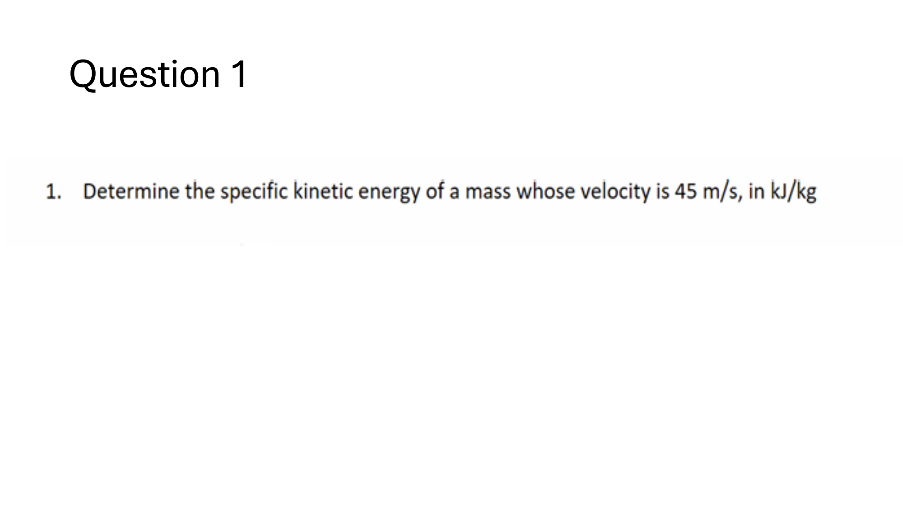
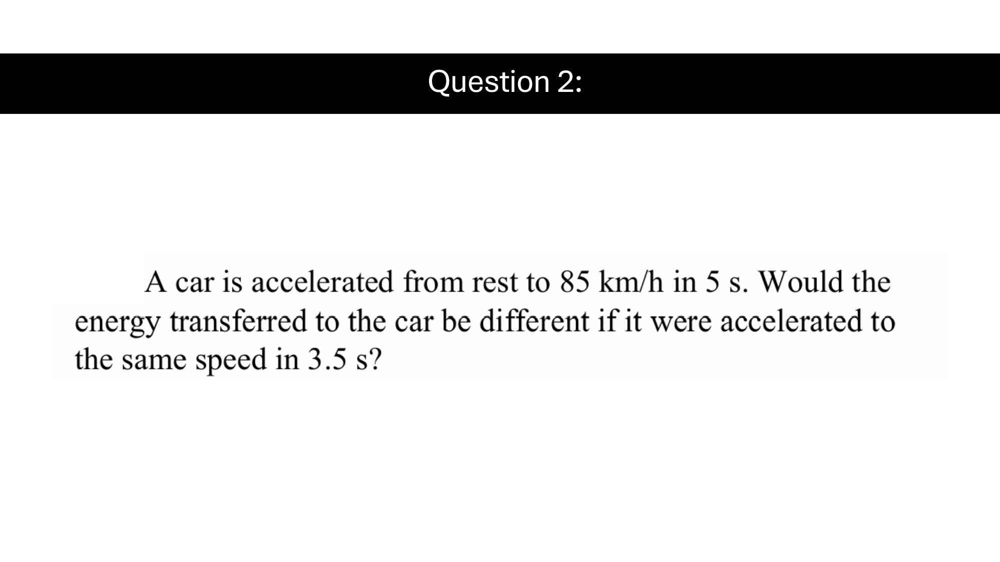
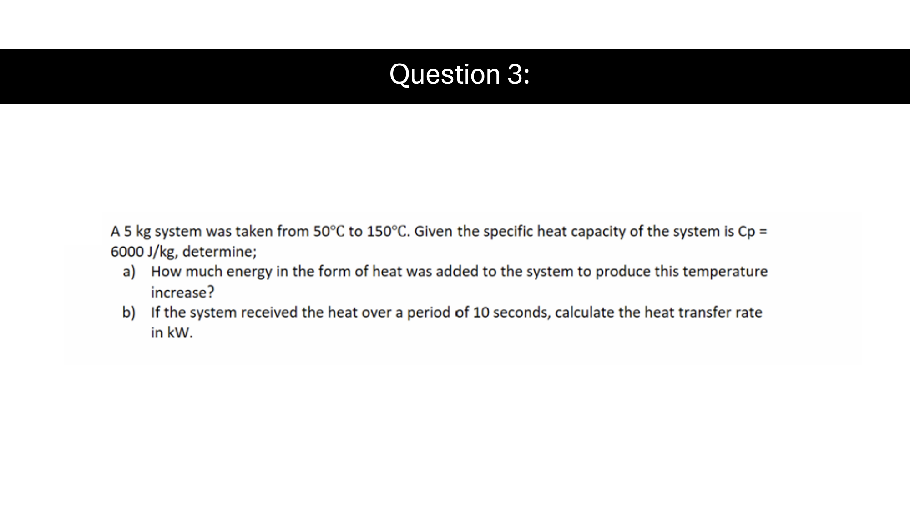
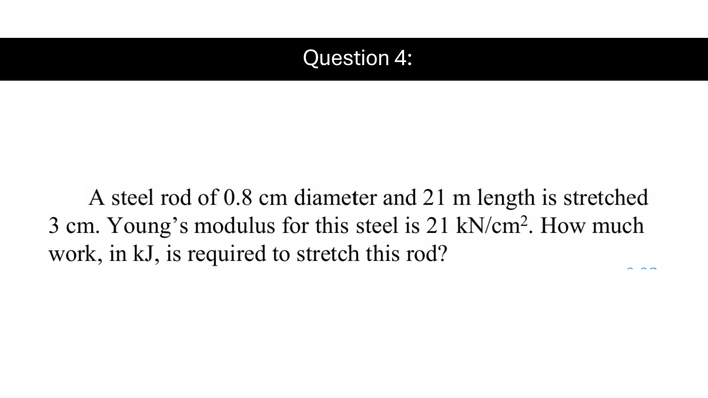
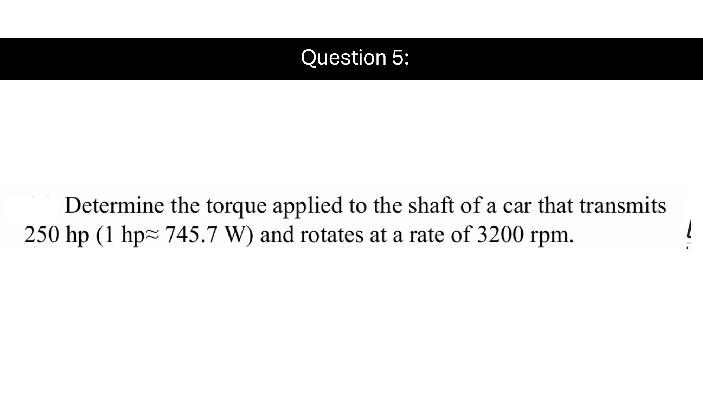
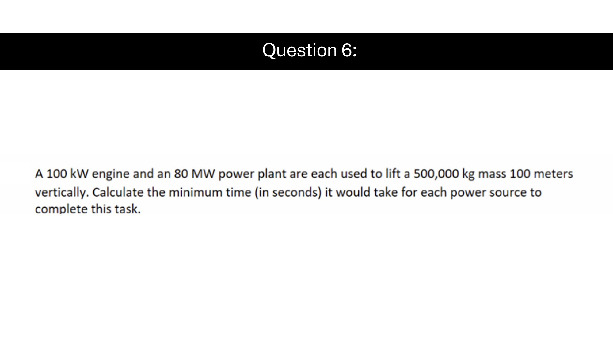
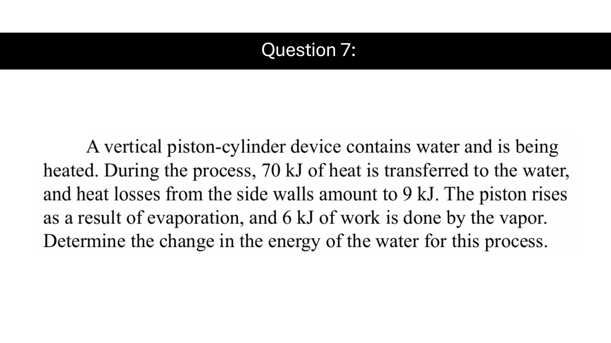
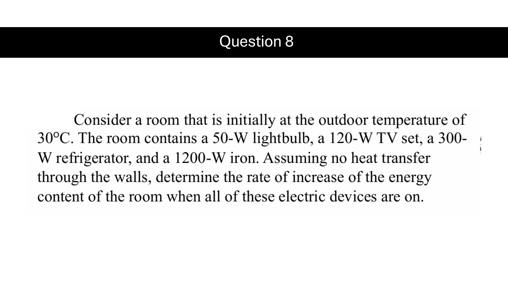
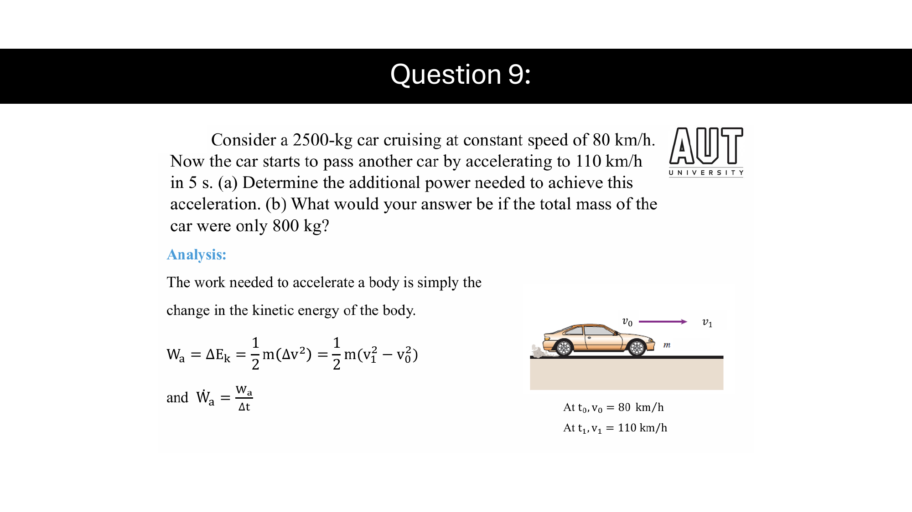
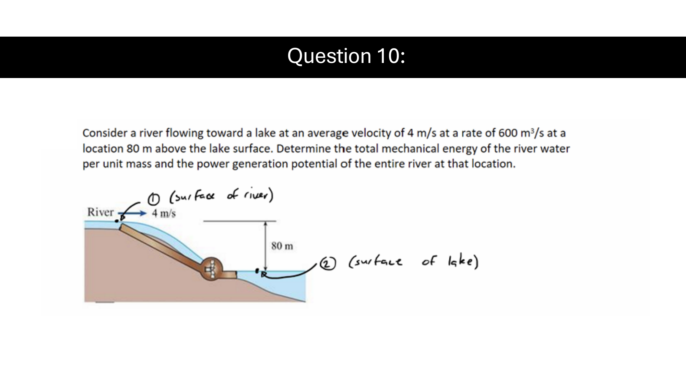

# Thermodynamics — Tutorial Week 2 Worked Solutions

> [!note] Scope and assumptions
> These solutions use the values printed on the locally stored 2026 Tutorial 2 slides. SI units are used throughout. Question 4 contains a likely source-unit error in Young’s modulus; both the literal printed result and the physically plausible steel result are shown explicitly. Numerical answers were independently recomputed.

## Question 1 — Specific kinetic energy

Specific kinetic energy is kinetic energy per unit mass:

$$
e_k=\frac{V^2}{2}.
$$

With $V=45\,\mathrm{m/s}$,

$$
e_k=\frac{(45)^2}{2}
=1012.5\ \mathrm{J/kg}.
$$

Convert to $\mathrm{kJ/kg}$:

$$
1012.5\ \mathrm{J/kg}
=1.0125\ \mathrm{kJ/kg}.
$$

Therefore,

$$
\boxed{e_k=1.0125\ \mathrm{kJ/kg}}.
$$

## Question 2 — Energy versus acceleration time

The car starts from rest and reaches the same final speed in both cases. Neglecting changes in elevation, drag, rolling resistance, and losses, the energy transferred to the car equals its change in kinetic energy:

$$
W=\Delta KE
=\frac12m(V_2^2-V_1^2).
$$

Here $V_1=0$ and the same $V_2=85\,\mathrm{km/h}$ is reached in both cases. Therefore,

$$
\boxed{W_{5.0\,\mathrm{s}}=W_{3.5\,\mathrm{s}}}.
$$

The energy is not different, but the average power is:

$$
\dot W_{\mathrm{avg}}=\frac{W}{\Delta t}.
$$

Thus,

$$
\frac{\dot W_{3.5}}{\dot W_{5.0}}
=\frac{5.0}{3.5}
=1.4286.
$$

So reaching the speed in $3.5\,\mathrm{s}$ requires approximately $42.9\%$ more average power than taking $5.0\,\mathrm{s}$, even though the ideal energy transfer is the same.

## Question 3 — Sensible heating and heat-transfer rate

Given

$$
m=5\,\mathrm{kg},
\qquad
c_p=6000\,\mathrm{J/(kg\,K)},
\qquad
\Delta T=150-50=100\,\mathrm{K}.
$$

### (a) Heat added

For constant specific heat,

$$
Q=mc_p\Delta T.
$$

Therefore,

$$
Q=(5)(6000)(100)
=3{,}000{,}000\,\mathrm{J}
=3000\,\mathrm{kJ}.
$$

Hence,

$$
\boxed{Q=3000\,\mathrm{kJ}=3.00\,\mathrm{MJ}}.
$$

### (b) Heat-transfer rate over 10 seconds

$$
\dot Q=\frac{Q}{\Delta t}
=\frac{3000\,\mathrm{kJ}}{10\,\mathrm{s}}
=300\,\mathrm{kJ/s}.
$$

Since $1\,\mathrm{kJ/s}=1\,\mathrm{kW}$,

$$
\boxed{\dot Q=300\,\mathrm{kW}}.
$$

## Question 4 — Work required to stretch a steel rod

For a linearly elastic rod,

$$
\sigma=E\varepsilon,
\qquad
\varepsilon=\frac{\delta}{L},
\qquad
F=\sigma A=EA\frac{\delta}{L}.
$$

Because the force rises linearly from zero to $F$, the work is

$$
W=\frac12F\delta
=\frac{EA\delta^2}{2L}.
$$

The rod area is

$$
A=\frac{\pi d^2}{4}
=\frac{\pi(0.008)^2}{4}
=5.02655\times10^{-5}\,\mathrm{m^2}.
$$

Also,

$$
L=21\,\mathrm{m},
\qquad
\delta=0.03\,\mathrm{m}.
$$

### Literal result using the value printed on the slide

The slide states

$$
E=21\,\mathrm{kN/cm^2}.
$$

Since $1\,\mathrm{kN/cm^2}=10^7\,\mathrm{Pa}$,

$$
E=2.1\times10^8\,\mathrm{Pa}=210\,\mathrm{MPa}.
$$

Then

$$
F=EA\frac{\delta}{L}
=(2.1\times10^8)(5.02655\times10^{-5})\frac{0.03}{21}
=15.0796\,\mathrm{N}.
$$

Therefore,

$$
W=\frac12(15.0796)(0.03)
=0.226195\,\mathrm{J}
=2.26195\times10^{-4}\,\mathrm{kJ}.
$$

Using the slide literally,

$$
\boxed{W=2.262\times10^{-4}\,\mathrm{kJ}}.
$$

### Source-data warning

The printed modulus $210\,\mathrm{MPa}$ is approximately one thousand times smaller than a typical steel Young’s modulus of $210\,\mathrm{GPa}$. If the intended value was

$$
E=21{,}000\,\mathrm{kN/cm^2}=210\,\mathrm{GPa},
$$

then the work would be one thousand times larger:

$$
\boxed{W\approx0.2262\,\mathrm{kJ}}.
$$

The lecturer or tutor should confirm which modulus was intended.

## Question 5 — Shaft torque from power and speed

Power and torque are related by

$$
\dot W=\tau\omega.
$$

Convert the transmitted power:

$$
\dot W=(250\,\mathrm{hp})(745.7\,\mathrm{W/hp})
=186{,}425\,\mathrm{W}.
$$

Convert $3200\,\mathrm{rpm}$ to angular velocity:

$$
\omega
=(3200\,\mathrm{rev/min})
\left(\frac{2\pi\,\mathrm{rad}}{1\,\mathrm{rev}}\right)
\left(\frac{1\,\mathrm{min}}{60\,\mathrm{s}}\right)
=335.103\,\mathrm{rad/s}.
$$

Thus,

$$
\tau=\frac{\dot W}{\omega}
=\frac{186{,}425}{335.103}
=556.321\,\mathrm{N\,m}.
$$

Therefore,

$$
\boxed{\tau\approx556.3\,\mathrm{N\,m}}.
$$

## Question 6 — Minimum lifting time

The ideal work required to lift the mass is its increase in gravitational potential energy:

$$
W=mgh.
$$

With $m=500{,}000\,\mathrm{kg}$, $g=9.81\,\mathrm{m/s^2}$, and $h=100\,\mathrm{m}$,

$$
W=(500{,}000)(9.81)(100)
=4.905\times10^8\,\mathrm{J}.
$$

The minimum ideal time is

$$
t=\frac{W}{\dot W}.
$$

### 100 kW engine

$$
t_{100\,\mathrm{kW}}
=\frac{4.905\times10^8}{100\times10^3}
=4905\,\mathrm{s}.
$$

Therefore,

$$
\boxed{t_{100\,\mathrm{kW}}=4905\,\mathrm{s}=81.75\,\mathrm{min}}.
$$

### 80 MW power plant

$$
t_{80\,\mathrm{MW}}
=\frac{4.905\times10^8}{80\times10^6}
=6.13125\,\mathrm{s}.
$$

Thus,

$$
\boxed{t_{80\,\mathrm{MW}}\approx6.13\,\mathrm{s}}.
$$

These are ideal minimum times; real systems would take longer because of efficiency and power-delivery limits.

## Question 7 — Closed-system energy balance

Use the closed-system energy balance with heat into the system positive and work done by the system positive:

$$
\Delta E=Q-W.
$$

The net heat transferred to the water is

$$
Q=Q_{\mathrm{in}}-Q_{\mathrm{loss}}
=70-9
=61\,\mathrm{kJ}.
$$

The piston does $6\,\mathrm{kJ}$ of work on the surroundings, so

$$
W=6\,\mathrm{kJ}.
$$

Therefore,

$$
\Delta E=61-6=55\,\mathrm{kJ}.
$$

Hence,

$$
\boxed{\Delta E_{\mathrm{water}}=+55\,\mathrm{kJ}}.
$$

The positive sign means the water’s total energy increased.

## Question 8 — Rate of increase of room energy

With no heat transfer through the walls, all electrical power consumed by the devices ultimately increases the room’s energy. Sum the device powers:

$$
\frac{dE_{\mathrm{room}}}{dt}
=50+120+300+1200
=1670\,\mathrm{W}.
$$

Therefore,

$$
\boxed{\frac{dE_{\mathrm{room}}}{dt}=1670\,\mathrm{W}=1.67\,\mathrm{kW}}.
$$

The initial room temperature is not needed for the requested energy-rate calculation.

## Question 9 — Additional power for vehicle acceleration

Neglecting losses, the additional work is the change in kinetic energy:

$$
W_a=\frac12m(V_1^2-V_0^2).
$$

Convert the speeds:

$$
V_0=\frac{80}{3.6}=22.2222\,\mathrm{m/s},
$$

$$
V_1=\frac{110}{3.6}=30.5556\,\mathrm{m/s}.
$$

The average additional power over $\Delta t=5\,\mathrm{s}$ is

$$
\dot W_a
=\frac{m(V_1^2-V_0^2)}{2\Delta t}.
$$

### (a) $m=2500\,\mathrm{kg}$

$$
\dot W_a
=\frac{(2500)\left[(30.5556)^2-(22.2222)^2\right]}{2(5)}
=109{,}953.7\,\mathrm{W}.
$$

Therefore,

$$
\boxed{\dot W_a\approx109.95\,\mathrm{kW}}.
$$

### (b) $m=800\,\mathrm{kg}$

$$
\dot W_a
=\frac{(800)\left[(30.5556)^2-(22.2222)^2\right]}{2(5)}
=35{,}185.2\,\mathrm{W}.
$$

Thus,

$$
\boxed{\dot W_a\approx35.19\,\mathrm{kW}}.
$$

## Question 10 — River mechanical energy and generation potential

For an incompressible stream, total mechanical energy per unit mass is

$$
e_{\mathrm{mech}}
=\frac{P}{\rho}+\frac{V^2}{2}+gz.
$$

Take the lake surface as $z=0$. Both the river and lake surfaces are exposed to atmospheric pressure, so their gauge pressure is zero. At the river location,

$$
V=4\,\mathrm{m/s},
\qquad
z=80\,\mathrm{m}.
$$

Therefore,

$$
e_{\mathrm{mech}}
=0+\frac{4^2}{2}+(9.81)(80)
=8+784.8
=792.8\,\mathrm{J/kg}.
$$

Thus,

$$
\boxed{e_{\mathrm{mech}}=0.7928\,\mathrm{kJ/kg}}.
$$

Using $\rho\approx1000\,\mathrm{kg/m^3}$ and $\dot V=600\,\mathrm{m^3/s}$, the mass-flow rate is

$$
\dot m=\rho\dot V
=(1000)(600)
=600{,}000\,\mathrm{kg/s}.
$$

The theoretical power-generation potential is

$$
\dot W_{\max}=\dot m\,e_{\mathrm{mech}}.
$$

Hence,

$$
\dot W_{\max}
=(600{,}000)(792.8)
=4.7568\times10^8\,\mathrm{W}.
$$

Therefore,

$$
\boxed{\dot W_{\max}=475.68\,\mathrm{MW}}.
$$

This is an ideal upper bound; real electrical output is lower because of losses.

## Final answers at a glance

- **1:** $1.0125\,\mathrm{kJ/kg}$.
- **2:** Same ideal energy; the $3.5\,\mathrm{s}$ acceleration requires $1.4286$ times the average power.
- **3:** $Q=3000\,\mathrm{kJ}$, $\dot Q=300\,\mathrm{kW}$.
- **4:** Literal printed modulus: $2.262\times10^{-4}\,\mathrm{kJ}$; if $E=210\,\mathrm{GPa}$ was intended: $0.2262\,\mathrm{kJ}$.
- **5:** $556.3\,\mathrm{N\,m}$.
- **6:** $4905\,\mathrm{s}$ at $100\,\mathrm{kW}$; $6.13\,\mathrm{s}$ at $80\,\mathrm{MW}$.
- **7:** $\Delta E=+55\,\mathrm{kJ}$.
- **8:** $1.67\,\mathrm{kW}$.
- **9:** $109.95\,\mathrm{kW}$ for $2500\,\mathrm{kg}$; $35.19\,\mathrm{kW}$ for $800\,\mathrm{kg}$.
- **10:** $0.7928\,\mathrm{kJ/kg}$ and $475.68\,\mathrm{MW}$ ideal potential.
